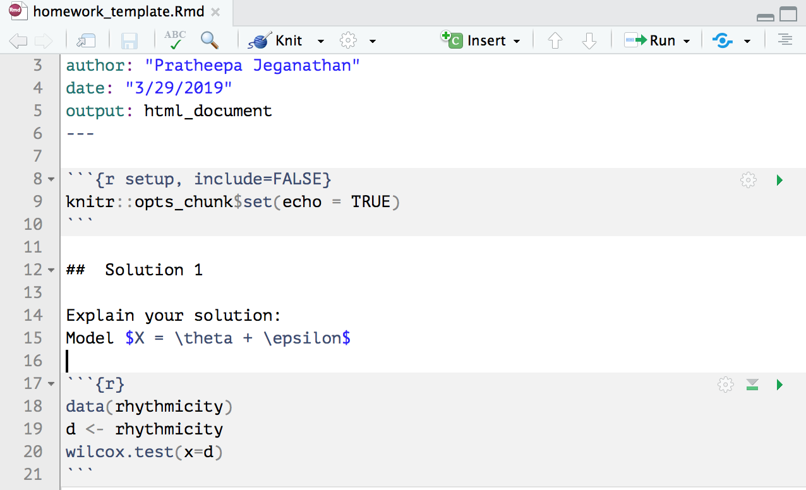

```{r setup, include=FALSE}
knitr::opts_chunk$set(echo = TRUE, fig.width = 3,fig.height = 3)
```

# Logistics

## Course description

- Rank-based testing (classical nonparametric techniques), R-estimators, nonparametric confidence intervals. 
- Modern nonparametric (jackknife, bootstrap).
- Curve fitting (density, survival functions, regression function), wavelets, confidence sets.
- Bayesian nonparametric, credible intervals.

## Expected outcomes

By the end of the course, the student should be able to 

- understand the assumptions underlying the nonparametric methods
- apply nonparametric methods to modern data analysis problems
- get hands-on experience in implementing methods and using existing R packages

##  General information

- Course website: [Canvas @ Stanford University ](https://canvas.stanford.edu/courses/99104)
- Homework will be assigned on Fridays (send solutions to TA)
- Midterm and finals will be a project proposal and a project report
- Instructor's office hours: Wednesdays 2.30 p.m. - 4 p.m. in 105 Sequoia or by an email appointment.
- TA's Office hours: Thursdays 8 a.m. - 10 a.m., location: Sequoia 207 (Bowker)

## Textbook

- Required textbook: **(HWC)** [Nonparametric Statistical Methods by Myles Hollander, Douglas A. Wolfe, Eric Chicken]
    - [By chapter: https://onlinelibrary.wiley.com/doi/book/10.1002/9781119196037](https://onlinelibrary.wiley.com/doi/book/10.1002/9781119196037)

    - [Entire book: https://onlinelibrary.wiley.com/doi/pdf/10.1002/9781119196037](https://onlinelibrary.wiley.com/doi/pdf/10.1002/9781119196037)

##
- Comprehensive coverage of nonparametric techniques and the assumptions underlying the methods. 

- Well-organized (procedure, large-sample approximation, ties, examples, comments, properties, problems, efficiency)

- Bibliography in detail.

- List of R functions used throughout the text.


##
- Recommended textbooks: Lecture notes may include some chapters from the following textbooks:
    - **(DH)**: Davison and Hinkley (1997). Boostrap Method and Their Application.
    <!-- - **(EH)**: Efron and Hastie (2016). Computer Age Statistical Inference: Algorithms, Evidence, and Data Science. -->
    - **(ET)**: Efron and Tibshirani (1994). [An Introduction to the Bootstrap](https://searchworks.stanford.edu/view/9980237).
    - **(KM)**: Kloke and McKean (2015). [Nonparametric Statistical Methods Using R](https://searchworks.stanford.edu/view/10718635).
    - **(L)**: Lehmann (2006). Nonparametrics: Statistical Methods Based on Ranks.
    - **(RHG)**: Ramsay, Hooker, Graves (2009). [Functional Data Analysis with R and MATLAB](https://searchworks.stanford.edu/view/9109922).
    - **(W)**: Wasserman (2006). [All of Nonparametric Statistics](https://searchworks.stanford.edu/view/6263491).
    
##
Lecture notes may use the following journal papers (more papers will be added as needed).
These papers will be listed in the reference section. 

- Recommended Readings: a reading list will be posted on Canvas.
    - **Re:BHLLSW2009**: Buja, Cook, Hofmann, Lawrence, Lee, Swayne, and Wickham (2009). Statistical Inference for Exploratory Data Analysis and Model Diagnostics.
    - **Re:D1983**: Diaconis (1983). Theories of Data Analysis: From Magical Thinking Through Classical Statistics.
    - **Re:DH1994**: Diaconis and Holmes (1994). Gray Codes for Randomization Procedures.
    - **Re:DH1995**: Diaconis and Holmes (1995). Discrete Probability and Algorithms: Three Examples of Monte-Carlo Markov Chains: At the Interface Between Statistical Computing, Computer Science, and Statistical Mechanics, pg. 43-56.
    - **Re:JWH2014**: Josse, Wager, and Husson (2014). Confidence Areas for Fixed-Effects PCA.
    

##  Grading

- Class participation (5%) [Canvas discussion about R and R Markdown, class activities, etc.]
- Weekly homework assignments (50%)
- Midterm project proposal (10%, due on 05/03/2019)
- Final project (35%, due on 06/05/2019)

##  Homework assignments (Template)

- See the template in [Canvas/Files/Templates](https://canvas.stanford.edu/courses/99104/files/folder/Templates)
- See the following [link](http://www.stat.cmu.edu/~cshalizi/rmarkdown/) for a further outline of using [R markdown for reporting](http://www.stat.cmu.edu/~cshalizi/rmarkdown/rmarkdown.Rmd).

## Project 
1. A case study:
    - If you have some original data, and a statistical problem that you want to solve with nonparametric statistics, for example, [see this project](https://github.com/jmoore523/STATS205-DRCConflict).
2. A comparative study
    - If you would like to compare the performance of the nonparametric statistical methods with other methods in different situations, for example, compare the wavelet method and penalized regression for estimating Doppler signal.
3. A literature review on related papers:
    - Papers will be provided and the literature review should involve in-depth summaries and exposition of one of these papers. You have the freedom to select a paper of your own interest, as long as it is related to the topics of this course.
    
## Grading (midterm project proposal)

The project will be split into two parts:

- Midterm project 3-5 pages long (excluding bibliography that should be very complete) (10%):
    1. A simple and clear exposition of the problem that you are addressing.
    2. Describe the data.
    3. Review of available methods for such data.
    4. List the advantages and disadvantages of those methods, in particular, parametric versus nonparametric methods.
    5. A proposed solution to the problem using the nonparametric method.
    6. Present a flowchart of the various tasks to complete your project: data collection, programming, simulation, etc.

##  Grading (final project report)   
- Final project report 10-12 pages long (excluding bibliography that should be very complete) (35%):
    1. Background of the data and why it is interesting or important.
    2. Explanation of the method studied and its properties.
    3. Data analysis or simulation study.
    4. Interpretation of the results or discussion. 


# Preliminaries

##  Motivating quote 

"In the last quarter-century, a class of nonparametric techniques has been fostered by the development of powerful, high-speed computing technology, which nowhere is statistics has been felt more profoundly than in nonparametric methods. The development has allowed some older nonparametric techniques, formerly studies largely from a theoretical viewpoint, to be applied as practical, adaptive tools; and it has spawned a particularly wide range of new statistical methods in curve estimation, sample reuse techniques, nonparametric concepts of likelihood, and other areas." - **Peter Hall** (theoretical research to computing) [@hall2001](https://academic.oup.com/biomet/article/88/1/143/221398) 


"If you wanted to do foundational research in statistics in the mid-twentieth century, you had to be a bit of a mathematician, ... if you want to do statistical research at the turn of the twenty-first century, you have to be a computer programmer." - **Andrew Gelman** [@gelman2009](https://arxiv.org/pdf/1001.2968.pdf)


##  Advantages (HWC: Chapter 1)

1. Few assumptions on the underlying populations (for example, forgo the assumption that the underlying populations are normal).
2. Enable to compute exact  P-values, coverage probabilities, experiment-wise error without relying on normal assumptions.
3. Often easier to apply than their parametric counterparts.
4. Easy to understand.
5. Slightly less efficient than parametric test when parametric assumptions hold, but if assumptions don't hold then mildly or wildly more efficient.
6. Robust to outliers.
7. Can be used in many practical situations where theory is intractable (jackknife, bootstrap).
8. Nonparametric + prior information -> Bayesian nonparametric approach.


# History

##  History 1930's to 1970's (**HWC**: Chapter 1.6)

- Hotelling and Pabst 1936, beginning of nonparametric statistics (rank correlation).
- Wilcoxon (1945), two-sample rank sum test and paired-sample signed rank test for equal sample sizes and Mann and Whitney (1947) generalization.
- Pitman (1948), Hodges and Lehmann (1956), and Chernoff and Savage (1958), efficiency properties.
- Quenouille (1949), Jackknife as a bias-reduction technique and extended by Tukey (1958, 1962) to provide approximate significance tests and confidence intervals.
- Hodges and Lehmann (1963), estimators from rank tests and their desirable properties.
- Cox (1972), nonparametric models and methods for survival analysis.

## History 1970’s to Now

- Efron’s (1979), bootstrap makes use of increasing computational resources to provide standard errors and confidence intervals where difficult, if not impossible, to use a parametric approach.

- Most recent topics (@randles2004):
    - Robust analysis of linear models (McKean, 2004).
    - Density estimation (Sheather, 2004).
    - Data modeling via quantile methods (Parzen, 2004).
    - Kernel smoothers (Schucany, 2004).
    - Permutation-based inference (Ernst, 2004).
    - Multivariate signed rank tests in time series problems 
      (Hallin and Paindaveine, 2004).
    - Generalizations for nonlinear manifolds 
      (Patrangenaru and Ellingson 2015).
      
- The Journal of Nonparametric Statistics (1991 the first issue), devoted to nonparametric methods.


##  Bayesian History

- Ferguson (1973), nonparametric Bayesian methods.
- Susarla and van Ryzin (1976), nonparametric Bayesian estimators of survival curves.
- Dykstra and Laud (1981), Bayesian nonparametric approach to reliability.
- Hjort (1990b), nonparametric Bayesian estimators to model the cumulative hazard.
- In the late 1980s and the 1990s (Gelfand and Smith (1990), Gamerman (1991), West (1992), Smith and Roberts (1993), and Arjas and Gasbarra (1994)), a surge of activity in Bayesian methods due to the Markov chain Monte Carlo (MCMC) methods
- Metropolis et al. (1953), Hastings (1970), and Green (1995), key algorithms for developing and implementing modern Bayesian methods include the Metropolis-Hastings-Green algorithm 
- Tanner-Wong (1987), data augmentation algorithm.

#  Software

##  Introduction to R 

We will use R and R Markdown for this course (highly recommended). The examples in the lecture notes and homework assignments will be written in R. Choosing R for your homework solutions and project is highly recommended. 

- Follow this [https://www.r-project.org/](https://www.r-project.org/) to install R:
    - R is an interpreted language, which means you will not have to compile your code and your actual code will be executed.
    - R is interactive for data analysis.
    - R includes interfaces to other programming languages (Python, Julia, C++), which means you can adapt R to big data analysis or computationally intensive procedures [@chambers2017].
    - Read more about R: [here](https://www.r-project.org/about.html).

##  Introduction to R Markdown 

- Follow this [https://www.rstudio.com/](https://www.rstudio.com/) to install R Studio (The newest version of R Studio is highly recommended (v1.1.463)): we will use R Markdown from R Studio to
    - track data analysis. 
    - produce high-quality documents that can be shared with your collaborators.
    - reproduce the results.
    - Read more about R Markdown: [here](https://rmarkdown.rstudio.com/index.html).
    
## Introduction to Latex 

(optional, if you will render R Markdown to HTML documents and if you'll use some other word processor to write a report for your project)

- Latex, which will enable you to create PDFs directly from the R Markdown in RStudio.
    - Mac users should download macTeX [http://www.tug.org/mactex/downloading.html](http://www.tug.org/mactex/downloading.html) from Safari (not Chrome).
    - Windows users should install MiKTeX [https://miktex.org/download](https://miktex.org/download).
    
    
# Basics of R and R Markdown

##  Vectors

These examples follow **(KM)**: Kloke and McKean (2015). Nonparametric Statistical Methods Using R. Chapter 1

## Matrices and data frames

Make vectors:

```{r}
x <- c(11,218,123,36,1001)
y <- rep(1,5)
z <- seq(1,5,by =1)
```

Vector operations:
```{r}
y + z

u = y + z # comments: assign the value to variable u
u
```

##

Some more operations
```{r}
sum(x)

c(mean(x),sd(x),var(x),median(x))

length(x)
```

##  Generate a random sample

Ex: coin tossing

```{r}
coin <- c("H", "T")
set.seed(100)
samples <- sample(x= coin, size =100, replace = TRUE)
```

the number times _H_ shows up
```{r}
sum(samples == "H")
```


##  Matrices

combine vectors of same data type into matrices
```{r}
X = cbind(x,y,z)
X
```

##
create a matrix using R function from the base package

```{r}
Y = matrix(data = c(2,3,4,5,6,7), nrow = 2, ncol =3, byrow = TRUE)
Y
```

##  Data frame
combine vectors of different data types
```{r}
subjects = c('Jim','Jack','Joe','Mary','Jean')
score = c(85,90,75,100,70)
D = data.frame(subjects = subjects, score = score)
D
```

##

```{r}
D$class = c("Jun", "Sopho","Sopho", "Sopho", "Jun")
D
```

##  Generating random variables

R provides numerous functions for random number generation

Ex: generate standard normal random variable
```{r}
z = rnorm(n = 100, mean = 0, sd = 1)
```

```{r}
summary(z)
```

## Graphics
Basic plotting Ex: histogram of $Z$

```{r }
hist(z,breaks = 30)
```

##  Sophisticated plots

The ggplot2 package is very popular to make more sophisticated plots

```{r}
library(ggplot2)
```

You are encouraged to learn the grammar of ggplot. There are many tutorials online. Here is one example [link](http://www.cookbook-r.com/Graphs/).

##  

Let's see how to use ggplot2 for scatter plots on automobile data 
```{r message=FALSE,warning=FALSE,eval=FALSE}
data(mtcars)
ggplot(mtcars, aes(x=wt,y=mpg)) + 
  geom_point(position=position_jitter(w=0.1,h=0)) +
  geom_smooth() + xlab('Weight (1000 lbs)') + 
  ylab("Miles/(US) gallon")
```

##
```{r message=FALSE,warning=FALSE, echo=FALSE}
data(mtcars)
ggplot(mtcars, aes(x=wt,y=mpg)) + 
  geom_point(position=position_jitter(w=0.1,h=0)) +
  geom_smooth() + xlab('Weight (1000 lbs)') + 
  ylab("Miles/(US) gallon")
```


##  Repeating tasks

In addition to `for` loop, R provides `apply` and `tapply` functions to replicate code a number of times
```{r}
X
```
row-wise mean 
```{r}
apply(X,1,mean)
```

##

column-wise mean
```{r}
apply(X,2,mean)
```

```{r}
D
tapply(D$score,D$class,mean)
```

##  User defined functions

```{r}
mSummary = function(x) {
  q1 = quantile(x,.25)
  q3 = quantile(x,.75) 
  list(med=median(x),iqr=q3-q1)
}
xsamp = 1:13
mSummary(xsamp)
```


##  Monte Carlo simulations

Generate a dataset with 100 rows and 10 columns. Each row is from a standard normal distribution. 

```{r}
set.seed(1000)
X = matrix(rnorm(10*100),ncol=10)
```

Sample mean of each of the 100 samples:
```{r}
xbar = apply(X, MARGIN = 1, FUN = mean)
```

Variance of sample mean:
```{r}
var(xbar)
```

compared to theoretical results: $\frac{\sigma^2}{n}$
```{r}
1/10
```

##  R packages

Two distribution site: CRAN and Bioconductor

In addition to commonly used functions in R, some other functions are available from developers. In order to have access to all of the functions used throughout the text **HWC**, we need to install and load `NSM3` package.

```{r message=FALSE,warning=FALSE,eval=FALSE}
install.packages("NSM3")
```

```{r}
library(NSM3)
data(rhythmicity)
head(rhythmicity)
```


# Templates 

##  Homework template

- See the template in Canvas/Files/Templates

- See the following [link](http://www.stat.cmu.edu/~cshalizi/rmarkdown/) for a further outline of using [R markdown for reporting](http://www.stat.cmu.edu/~cshalizi/rmarkdown/rmarkdown.Rmd).

##




##  Notations

- X: random variable
- x: relaizations (observed random variables)
- $f(x)$: probability density function (pdf)
- $F_{X}(x) =  P(X \leq x )$: cumulative distribution function (cdf)
- $X_{1}, \cdots\ X_{n}$: random sample (independent and identically distributed)


<!-- - Order statistics facts: $X_{1}, \cdots\ X_{n} \sim F(x)$, $F(X_{(1)}) \leq  \cdots \leq F(X_{(n)})$ -->
<!-- - probability integral transfomation -->

<!-- - Distribution of ranks -->

<!-- ##  Notations (cont.) -->

<!-- - Symmetric distribution: $\left( X-\mu\right) \overset{d}{=} \left( \mu - X\right)$ -->

<!-- - Homework problem 1: Assume $X$ is symmetric about $\mu$. Show that $F(\mu+t) =  1- F(\mu-t)$ (definition of symmetry). -->

<!-- - Statistic $t(\cdot)$ -->
<!--     - translational statistic -->
<!--     - translational invariant statistic -->

<!-- - Homework problem 2: Show that $\bar{X}$ mean is translational statistic and $S^{2}$ sample variance is translational invariant statistic. -->


# References

##  References for this lecture


