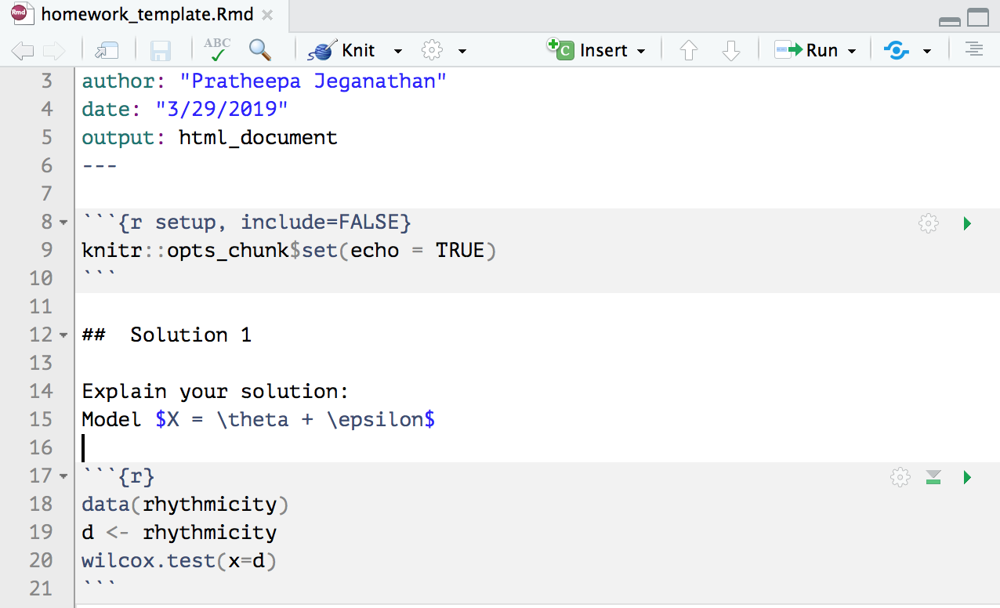

```{r setup, include=FALSE}
knitr::opts_chunk$set(echo = TRUE, fig.width = 3,fig.height = 3)
```

# Overview

##

- Rank-based testing (classical nonparametric techniques), R-estimators, nonparametric confidence intervals, modern nonparametric (bootstrap), curve fitting (density, regression function), confidence sets, wavelets, Bayesian nonparametric, credible intervals.

- Current interests
    - [Special issue in Statistical Sciences (A Review Journal of The Institute of Mathematical Statistics)](https://projecteuclid.org/euclid.ss/1113832719): gives papers for review project (17 articles) [@randles2004].
    
# Software

##  Introduction to R 

We will use R and R Markdown for this course (highly recommended). The examples in the lecture notes and homework assignments will be written in R. Choosing R for your homework solutions and project is highly recommended. 

- Follow this [https://www.r-project.org/](https://www.r-project.org/) to install R:
    - R is an interpreted language, which means you will not have to compile your code and your actual code will be executed.
    - R is interactive for data analysis.
    - R includes interfaces to other programming languages (Python, Julia, C++), which means you can adapt R to big data analysis or computationally intensive procedures [@chambers2017].
    - Read more about R: [here](https://www.r-project.org/about.html).

##  Introduction to R Markdown 

- Follow this [https://www.rstudio.com/](https://www.rstudio.com/) to install R Studio (The newest version of R Studio is highly recommended (v1.1.463)): we will use R Markdown from R Studio to
    - track data analysis. 
    - produce high-quality documents that can be shared with your collaborators.
    - reproduce the results.
    - Read more about R Markdown: [here](https://rmarkdown.rstudio.com/index.html).
    
## Introduction to Latex 

(optional, if you will render R Markdown to HTML documents and if you'll use some other word processor to write a report for your project)

- Latex, which will enable you to create PDFs directly from the R Markdown in RStudio.
    - Mac users should download macTeX [http://www.tug.org/mactex/downloading.html](http://www.tug.org/mactex/downloading.html) from Safari (not Chrome).
    - Windows users should install MiKTeX [https://miktex.org/download](https://miktex.org/download).
    
    
# Basics of R and R Markdown

##  Vectors

These examples follow **(KM)**: Kloke and McKean (2015). Nonparametric Statistical Methods Using R. Chapter 1

## Matrices and data frames

Make vectors:

```{r}
x <- c(11,218,123,36,1001)
y <- rep(1,5)
z <- seq(1,5,by =1)
```

Vector operations:
```{r}
y + z

u = y + z # comments: assign the value to variable u
u
```

##

Some more operations
```{r}
sum(x)

c(mean(x),sd(x),var(x),median(x))

length(x)
```

##  Generate a random sample

Ex: coin tossing

```{r}
coin <- c("H", "T")
set.seed(100)
samples <- sample(x= coin, size =100, replace = TRUE)
```

the number times _H_ shows up
```{r}
sum(samples == "H")
```


##  Matrices

combine vectors of same data type into matrices
```{r}
X = cbind(x,y,z)
X
```

##
create a matrix using R function from the base package

```{r}
Y = matrix(data = c(2,3,4,5,6,7), nrow = 2, ncol =3, byrow = TRUE)
Y
```

##  Data frame
combine vectors of different data types
```{r}
subjects = c('Jim','Jack','Joe','Mary','Jean')
score = c(85,90,75,100,70)
D = data.frame(subjects = subjects, score = score)
D
```

##

```{r}
D$class = c("Jun", "Sopho","Sopho", "Sopho", "Jun")
D
```

##  Generating random variables

R provides numerous functions for random number generation

Ex: generate standard normal random variable
```{r}
z = rnorm(n = 100, mean = 0, sd = 1)
```

```{r}
summary(z)
```

## Graphics
Basic plotting Ex: histogram of $Z$

```{r }
hist(z,breaks = 30)
```

##  Sophisticated plots

The ggplot2 package is very popular to make more sophisticated plots

```{r}
library(ggplot2)
```

You are encouraged to learn the grammar of ggplot. There are many tutorials online. Here is one example [link](http://www.cookbook-r.com/Graphs/).

##  

Let's see how to use ggplot2 for scatter plots on automobile data 
```{r message=FALSE,warning=FALSE,eval=FALSE}
data(mtcars)
ggplot(mtcars, aes(x=wt,y=mpg)) + 
  geom_point(position=position_jitter(w=0.1,h=0)) +
  geom_smooth() + xlab('Weight (1000 lbs)') + 
  ylab("Miles/(US) gallon")
```

##
```{r message=FALSE,warning=FALSE, echo=FALSE}
data(mtcars)
ggplot(mtcars, aes(x=wt,y=mpg)) + 
  geom_point(position=position_jitter(w=0.1,h=0)) +
  geom_smooth() + xlab('Weight (1000 lbs)') + 
  ylab("Miles/(US) gallon")
```


##  Repeating tasks

In addition to `for` loop, R provides `apply` and `tapply` functions to replicate code a number of times
```{r}
X
```
row-wise mean 
```{r}
apply(X,1,mean)
```

##

column-wise mean
```{r}
apply(X,2,mean)
```

```{r}
D
tapply(D$score,D$class,mean)
```

##  User defined functions

```{r}
mSummary = function(x) {
  q1 = quantile(x,.25)
  q3 = quantile(x,.75) 
  list(med=median(x),iqr=q3-q1)
}
xsamp = 1:13
mSummary(xsamp)
```


##  Monte Carlo simulations

Generate a dataset with 100 rows and 10 columns. Each row is from a standard normal distribution. 

```{r}
set.seed(1000)
X = matrix(rnorm(10*100),ncol=10)
```

Sample mean of each of the 100 samples:
```{r}
xbar = apply(X, MARGIN = 1, FUN = mean)
```

Variance of sample mean:
```{r}
var(xbar)
```

compared to theoretical results: $\frac{\sigma^2}{n}$
```{r}
1/10
```

##  R packages

Two distribution site: CRAN and Bioconductor

In addition to commonly used functions in R, some other functions are available from developers. In order to have access to all of the functions used throughout the text **HWC**, we need to install and load `NSM3` package.

```{r message=FALSE,warning=FALSE,eval=FALSE}
install.packages("NSM3")
```

```{r}
library(NSM3)
data(rhythmicity)
head(rhythmicity)
```


# Templates 

##  Homework template

- See the template in Canvas/Files/Templates

- See the following [link](http://www.stat.cmu.edu/~cshalizi/rmarkdown/) for a further outline of using [R markdown for reporting](http://www.stat.cmu.edu/~cshalizi/rmarkdown/rmarkdown.Rmd).

##


<!-- ## Generate your homework template (R Markdown) -->

<!-- ## Generate your midterm project proposal template (R Markdown) -->

<!-- ## Generate your final project template (R Markdown) -->

# References

##  References for this lecture
