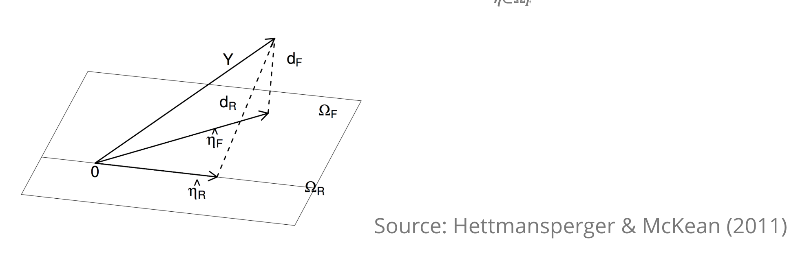

```{r setup, include=FALSE}
knitr::opts_chunk$set(echo = TRUE, fig.width = 4, fig.height = 3, fig.align="center",message=FALSE, warning=FALSE)
```

#  Recall

##
- One sample sign test, Wilcoxon signed rank test, large-sample approximation, median, Hodges-Lehman estimator, distribution-free confidence interval.
- Jackknife for bias and standard error of an estimator.
- Bootstrap samples, bootstrap replicates.
- Bootstrap standard error of an estimator.
- Bootstrap percentile confidence interval.
- Hypothesis testing with the bootstrap (one-sample problem.)
- Assessing the error in bootstrap estimates.
- Example: inference on ratio of heart attack rates in the aspirin-intake group to the placebo group.
- The exhaustive bootstrap distribution.


##
- Discrete data problems (one-sample, two-sample proportion tests, test of homogeneity, test of independence).
- Two-sample problems (location problem - equal variance, unequal variance, exact test or Monte Carlo, large-sample approximation, H-L estimator, dispersion problem, general distribution).
- Permutation tests (permutation test for continuous data, different test statistic, accuracy of permutation tests).
- Permutation tests (discrete data problems, exchangeability).

# The independence problem 

## Introduction
- Correlation: measures the degree of which two variables are related.
- Regression: measures the stochastic relationship between response variable and one or more predictor variables.
    - Regression relationship: simple linear regression, multiple linear regression, nonlinear regression.


## Correlation

- Consider random pairs $\left(X, Y\right)$. The strength of the relationship or association between $X$ and $Y$ is of our main interest.
- If $X$ and $Y$ are discrete, we can use odds ratio to measure the association and $\chi^{2}$ goodness-of-fit test for testing the association.
    - If $X$ and $Y$ are independent $P\left(X= x, Y=y\right)=P\left(X=x\right)P\left(Y=y\right)$ for all levels of $X$ and $Y$.
- If $X$ and $Y$ are continuous, from random sample $\left(X_{1}, Y_{1}\right), \cdots, \left(X_{n}, Y_{n}\right)$ we can use Pearson correlation coefficient or nonparametric Kendall or Spearman statistics to measure the strength of the association.

## Pearson's correlation coefficient

- Let $X$ and $Y$ be continuous random variables with mean $\mu_{X}$, $\mu_{Y}$ and standard deviation $\sigma_{X}$, $\sigma_{Y}$.
- Pearson's correlation coefficient is 
$$\rho = \dfrac{\E \left(X-\mu_{X} \right)\left(Y-\mu_{Y} \right)}{\sigma_{X}\sigma_{Y}} = \dfrac{\E \left(XY \right)- \E \left(X\right)\E \left(Y\right)}{\sigma_{X}\sigma_{Y}}.$$
- If $X$ and $Y$ are independent, $\E \left(XY \right) = \E \left(X\right)\E \left(Y\right)$. Thus, $\rho = 0$, converse is not true.
    - If $X$ and $Y$ are bivariate normal, converse is also true.
- If $X$ and $Y$ are dependent, $\rho \neq 0$.
- Pearson correlation coefficient measures the linear association between $X$ and $Y$. 

##  Estimate Pearson's correlation coefficient

- Sample Pearson's correlation coefficient:

$$\hat{\rho}=r = \dfrac{\sum_{i=1}^{n}\left(X_{i} - \bar{X}\right)\left(Y_{i} - \bar{Y}\right)}{\sqrt{\sum_{i=1}^{n}\left(X_{i} - \bar{X}\right)^{2}\sum_{i=1}^{n}\left(Y_{i} - \bar{Y}\right)^{2}}}.$$

- Slope in simple linear regression is related to sample Pearson's correlation coefficient.
$$\hat{\beta} = r\left(\dfrac{\hat{\sigma}_{Y}}{\hat{\sigma}_{X}}\right),$$

where $\hat{\sigma}_{X}$ and $\hat{\sigma}_{Y}$ are sample standard deviations of $X$ and $Y$, respectively and $\hat{beta}$ is the least squares estimate of slope in a simple regression of $Y$ on $X$.

## Pearson's correlation coefficient

- If $X$ and $Y$ have a bivariate normal distribution, testing Pearson's correlation coefficient using student's t-distribution.

- Testing using permutation method (assume $\left(X_{i}, Y_{\Pi(i)}\right)$ is exchangeable):
    - Under the null hypothesis of independence, define $\left(X_{i}, Y_{\Pi(i)}\right)$, where $\Pi(i)$ is any permutation of $\lbrace 1, \cdots, n \rbrace$.
  
- Construct confidence interval using bootstrap method.
    - Use nonparametric bootstrap: sample with replacement $\left(X_{i}, Y_{i} \right)$.

- Note:
    - If the range of the distribution is bounded, $\rho$ is always defined.
    - $\rho$ is not defined for Cauchy distribution (it has undefined variance).
    - Caution should be given for heavy-tailed distributions.
    - $\rho$ is high-sensitive to outliers and distribution assumption.
    
## The independence problem (tests based on signs - Kendall)

- Let $\left(X_{i}, Y_{i}\right), i=1, \cdots, n$ be IID bivariate observations from a joint distribution $F_{X,Y}\left(x,y \right)$.

- Testing independence
    - $\text{H}_{0}: F_{X,Y}\left(x,y \right) = F_{X}\left(x\right)F_{Y}\left(x \right)$ for all pairs $\left(x,y\right)$ versus $\text{H}_{A}:$ $X$ and $Y$ are dependent.
    
- Kendall population correlation coefficient $\tau$

$$\tau =  2 P\lbrace \left(Y_{2}-Y_{1}\right)\left(X_{2}-X_{1}  \right)>0\rbrace-1.$$

- $\tau$ measures the monotonicity between $X$ and $Y$.

- If $X$ and $Y$ are independent, $\tau  = 0$, converse is not true.

- If $\tau  \neq 0$, $X$ and $Y$ are dependent.


## The independence problem (tests based on signs - Kendall)

- $P\lbrace \left(Y_{2}-Y_{2}\right)\left(X_{2}-X_{1} > 0\right)\rbrace = P\left(X_{2} > X_{1}, Y_{2} > Y_{2}\right)P\left(X_{2} < X_{1}, Y_{2} < Y_{2}\right)$.

- Under $\text{H}_{0}$, $P\left(X_{2} > X_{1}, Y_{2} > Y_{2}\right) = \left(\dfrac{1}{2}\right)\left(\dfrac{1}{2}\right) = \left(\dfrac{1}{4}\right).$

- Thus, Under $\text{H}_{0}$, $\tau = 2 \left(\left(\dfrac{1}{4}\right)+\left(\dfrac{1}{4}\right)\right)-1 = 0.$


## The independence problem (tests based on signs - Kendall)

- $\text{H}_{0}: \tau = 0$ versus $\text{H}_{0}: \tau \neq 0$ or $\text{H}_{0}: \tau > 0$ or $\text{H}_{0}: \tau < 0$.
- Significance level $\alpha$.
- Test statistic: $\bar{K} = K/\left(n \left(n-1\right)/2 \right),$ where 
$$K= \sum_{i=1}^{n-1}\sum_{j=i+1}^{n}Q\left(\left(X_{i}, Y_{i}\right)\left(X_{j}, Y_{j}\right)\right),$$

where 
\begin{equation}
\notag
Q\left(\left(X_{i}, Y_{i}\right)\left(X_{j}, Y_{j}\right)\right)=
\left\{
\begin{array}{ll}
1 & ;\left(Y_{j}-Y_{i}\right)\left(X_{j}-X_{i}\right) > 0\\
-1 & ; \left(Y_{j}-Y_{i}\right)\left(X_{j}-X_{i}\right) < 0.
\end{array}
\right. 
\end{equation}

- $\left(Y_{j}-Y_{i}\right)\left(X_{j}-X_{i}\right) > 0$ concordant.
- $\left(Y_{j}-Y_{i}\right)\left(X_{j}-X_{i}\right) < 0$ discordant.

##  The independence problem (tests based on signs - Kendall)

```{r eval=FALSE}
cor.test(x, y,
         alternative = c("two.sided", "less", "greater"),
         method = c("pearson", "kendall", "spearman"),
         exact = NULL, conf.level = 0.95, 
  continuity = FALSE, ...)
```


##  The independence problem (tests based on signs - Kendall)
- The large-sample approximation:
    - $K^{*} = \dfrac{K}{\lbrace n(n-1)(2n+5)/18 \rbrace^{1/2}} \sim \text{N}\left(0, 1\right).$
- Ties: if there are tied $X$ values and or $Y$ values, assign zero to $Q$.
    - Approximate test.
    
## Example  (tests based on signs - Kendall)

- Hunter L measure of lightness $X$, along with panel scores $Y$ for nine lots of canned tuna $n =9$.
- It is suspected that the Hunter L value is positively associated with the panel score.
```{r}
Table8.1 = data.frame(x = c(44.4, 45.9, 41.9, 53.3, 
  44.7, 44.1, 50.7, 45.2, 60.1), 
  y = c( 2.6,  3.1,  2.5,  5.0,  3.6,  
    4.0,  5.2,  2.8,  3.8))
```

## Example  (tests based on signs - Kendall)

```{r}
cor.test(x = Table8.1$x, y = Table8.1$y, 
  method = "kendall", alternative = "greater")
```

- $T$ is sum of positive $Q$'s.

- $K = 2T - n(n-1)/2$. Now, we can use this for large-sample approximation.

## Kendall’ s sample rank correlation coefficient 
- $\hat{\tau} = \dfrac{2K}{n(n-1)}$.
- For the example

```{r}
T = 26
n = length(Table8.1$x)
K = 2*T-n*(n-1)/2; K
tau.hat = 2*K/(n*(n-1)); tau.hat
cor(Table8.1$x, Table8.1$y, method = "kendall")
```

## Bootstrap confidence interval (Kendall's correlation coefficient)

- Sample with replacement $\left(X_{i}, Y_{i}\right)$ to obtain bootstrap sample $\left(X_{i}^{*}, Y_{i}^{*}\right)$.
- Compute bootstrap replicate value of $\hat{\tau}^{*}$.
    - Necessary to use $Q = 0$ for ties. 
- From bootstrap replicates, $\hat{\tau}^{*1}, \hat{\tau}^{*2}, \cdots, \hat{\tau}^{*B}$, construct $\left(1-\alpha\right)100\%$ confidence interval for $\tau$.


## Bootstrap confidence interval (Kendall's correlation coefficient)

```{r}
library(NSM3)
kendall.ci(Table8.1$x, Table8.1$y, alpha=.05, 
  type="t", bootstrap = T, B = 1000)
```

## The indepndence problem (tests based on ranks - Spearman)

- Spearman rank correlation coefficient $\rho_{s}$.
- $\rho_{s}$ measures monotonic relationships (whether linear or not).
- Spearman's sample rank correlation coefficient $r_{s}$.
- Rank $X_{i}$'s, denote by $R_{i}$'s and rank $Y_{i}$'s, denote by $S_{i}$'s.
- $r_{s}$ is Pearson product moment sample correlation of $R_{i}$ and $S_{i}$.
$$r_{s} = 1 - \dfrac{6 \sum_{i=1}^{n}D_{i}^{2}}{n(n^{2}-1)},$$

$D_{i} = S_{i} - R_{i}, i=1, \cdots, n.$

## Example (tests based on ranks - Spearman)
```{r}
cor.test(x = Table8.1$x, y = Table8.1$y, 
  method = "spearman", alternative = "greater")
```

## Example (tests based on ranks - Spearman)
```{r}
cor(x = Table8.1$x, y = Table8.1$y, 
  method = "spearman")
```


# Rank-based regression analysis 


## Simple linear regression

- Linear regression in two-sample problem:
    - Combine $X_{i}; i = 1, \cdots, m$ and $Y_{j}; j = 1, \cdots, n$.
    - $Z = \left(X_{1}, \cdots, X_{m},Y_{1}, \cdots, Y_{n} \right)^{T},$ $N = n+m$.
    - Let $\vg = \left(1, \cdots, 1, 0, \cdots, 0\right)^{T}$, $1$'s in first $m$ position and rest is 0's.
    - Two-sample problem as a linear model: $Z_{i} = \beta_{0} + \Delta g_{i} + \epsilon_{i}, i= 1, \cdots, N,$ where $e_{1}, \cdots, e_{N} \sim F\left(\cdot\right)$.
    - Estimate $\Delta$ and test for $\Delta$.

## Rank-based linear regression
```{r echo=FALSE}
library(ggplot2)
car.df = cars
ggplot(data = car.df, aes(x = speed, y = dist)) + 
  geom_point() +
   stat_smooth(method = "lm", 
     formula = y ~ x, size = 1, se = FALSE,
    aes(colour = "LS")) +
  stat_smooth(method = "lm", 
    formula = rank(y) ~ rank(x), size = 1, 
    se = FALSE, aes(colour = "R")) +
  scale_colour_manual(name="Method", 
    values=c("black", "blue"))
```


## Test for slope (based on signs)

- Simple linear model: $Y_{i} = \alpha + \beta X_{i} + \epsilon_{i}.$
    - $\alpha$ - intercept
    - $\beta$ - slope
    - $\epsilon_{1}, \cdots, \epsilon_{n} \sim F\left( \cdot \right)$ with median 0.
- $\beta$ measures every unit increase in the value of the independent (predictor) variable $X$, expected increase (or decrease, depending on the sign) of the dependent (response) variable $Y$.

## Test for slope (based on signs - Theil (1950))

- $\text{H}_{0}:\beta = \beta_{0}$.

- Test statistic: $C = \sum_{i = 1}^{n-1}\sum_{j = i+1}^{n}\text{Sign}\left(D_{j} -D_{i} \right),$ where $D_{i} = Y_{i} - \beta_{0} x_{i}$.

- Motivation for the test statistic:
    - $D_{j} -D_{i} = Y_{j} - \beta_{0} x_{j} - Y_{i} + \beta_{0} x_{i} = Y_{j} - Y_{i} + \beta_{0} \left(x_{i}- x_{j}\right)$.
    - Median of  $Y_{j} - Y_{i} = \beta\left(x_{j}- x_{i}\right)$.
    - Thus, under $H_{0}$, median of $D_{i} -D_{j} = \beta\left(x_{j}- x_{i}\right) + \beta_{0} \left(x_{i}- x_{j}\right) = \left(\beta -\beta_{0} \right) \left(x_{j}- x_{i}\right)$.
    - When $\beta > \beta_{0},$ $D_{i} -D_{j}$ is positive and leads to larger $C$ values.
- $C$ is the Kendall's correlation statistics, and can be interpreted as a test for correlation between $X$ and $Y$.
- Slope estimator associated with Theil statistic
    $\hat{\beta} = \text{median}\lbrace S_{ij} ; 1 \leq i,j \leq n \rbrace$, where $S_{ij} = \dfrac{Y_{j}-Y_{i}}{x_{j} - x_{i}}; 1 \leq i,j \leq n$.
    
## Rank-based intercept estimator

- Define $A_{i} = Y_{i} - \hat{\beta}x_{i}, i = 1, \cdots, n.$
- A point estimator for $\alpha$ is $$\hat{\alpha} = \text{median} \lbrace A_{1}, \cdots, A_{n}\rbrace.$$

## Example (Testing slope)

- Effect of Cloud Seeding on Rainfall.
- Smith (1967) described experiment in Australia on cloud seeding.
- Investigate the effects of a particular method of cloud seeding on the amount of rainfall.
- Data
    - Two area of mountains served as target and control.
    - Effect of seeding was measured by the double ratio: [T/Q (seeded)]/[T/Q (unseeded)].
- The slope parameter $\beta$ represents the rate of change in $Y$ per unit change in $x$.
- Test $\text{H}_{0}: \beta = 0$ versus $\text{H}_{A}: \beta < 0$.
    
## Example (Testing slope)
```{r fig.show='hide'}
Table9.1 = data.frame(x.years.seeded = c(1,2,3,4,5), 
  Y.double.ratio = c(1.26,1.27,1.12,1.16,1.03))

theil.fit = theil (Table9.1$x.years.seeded, 
  Table9.1$Y.double.ratio,
  beta.0 = 0 ,
  slopes=TRUE,
  type = "l", 
  doplot = FALSE)
```

## Example (Testing slope)
```{r}
theil.fit
```

## Example (Testing slope)
```{r echo=FALSE}
theil.fit = theil(Table9.1$x.years.seeded, 
  Table9.1$Y.double.ratio,
  beta.0 = 0 ,
  slopes=TRUE,
  type = "l")
```

## Example (confidence interval for slope)
```{r }
theil.output = theil(Table9.1$x.years.seeded, 
  Table9.1$Y.double.ratio,
  beta.0 = 0 ,
  slopes=TRUE,
  type = "t", doplot = FALSE, alpha = .05)
c(theil.output$L, theil.output$U)
```

## General multiple linear regression

- Interest in the regression relationship between several (p) independent (predictor) variables and one response variable.
- $Y_{i} = \zeta + \beta_{1}x_{1i} + \beta_{2}x_{2i} + \cdots + \beta_{p}x_{pi} + e_{i}, i = 1, \cdots, n.$
- Let $\vbeta_{q} = \left[\beta_{1}, \cdots, \beta_{q} \right]^{T}$ and  $\vbeta_{p-q} = \left[\beta_{q+1}, \cdots, \beta_{p} \right]^{T}$.
- $\text{H}_{0}: \vbeta_{q} = 0$ versus $\text{H}_{A}: \vbeta_{q} \neq 0$.
- Read **HWC** Chapter 9.5
- Use `rfit()` command in R.

# The geometry of rank-based linear models

## Overview

- Reference [@hettmansperger2010, Chapter 3](hettmansperger2010) and HWC Chapter 9, page 484, comments 24, 25, and 26.
- Analysis (estimation, testing, diagnostic, outlier detection, detection of influential cases) can be based on either signs or ranks.
    - Error distribution could be either asymmetric (use sign) or symmetric (use rank).
 
## The geometry of rank-based linear models 

- The model: $Y_{i} = \alpha + \vx_{i}^{T}\vbeta + \epsilon_{i}, i = 1, \cdots, n$.
    - The location parameter of the distribution of $\epsilon_{i}$ is zero.
    - $\vbeta$ - $p \times 1$ vector of unknown parameters of interest.
    - $\alpha$ - intercept.
- The model in matrix form: $\vY = \vone \alpha + \mX \vbeta + \vep$.
    - $\mX$ has full column rank $p$.
    - Let $\Omega_{F}$ denote the column space spanned by the columns of $\mX$.
    - $\vY = \vone \alpha + \veta + \vep$, where $\veta \in \Omega_{F}$.
        - Coordinate-free model.
- Estimating $\veta$.
- Testing a general linear hypotheses $\text{H}_{0}: \mM \vbeta = 0$ versus $\text{H}_{A}: \mM \vbeta \neq 0$, where $\mM$ is a $q \times p$ matrix of full row rank.

## The geometry of rank-based linear models estimation
- Estimate $\veta$ by minimizing the distance between $\vY$ and the subspace $\Omega_{F}$.
    - Define distance in terms of norms or pseudo-norms: $\left\| \vv \right\| = \sum_{i=1}^{n}a\left(R\left(v_{i}\right) \right) v_{i}$, $a(1) \leq a(2) \leq \cdots a(n)$ a set of scores generated as $a(i) = \phi \left(\dfrac{i}{n+1}\right)$ and $\phi \left(u \right) \in \left( 0,1\right)$.
- Rank estimate of $\veta$ is a vector $\hat{\vY}_{\phi}$ such that

$$D_{\phi}\left(\vY, \Omega_{F} \right) = \left\| \vY - \hat{\vY}_{\phi} \right\|_{\phi} = \underset{\veta \in \Omega_{F}}{\text{min}}\left\|\vY - \veta  \right\|_{\phi}.$$
   
- $\hat{\vbeta}_{\phi} = \left(\mX^{T} \mX \right)^{-1}\mX^{T}\hat{\vY}_{\phi}$ and $\hat{\alpha} = \text{median}\lbrace Y_{i} - \vx_{i}^{T}\hat{\vbeta}_{\phi}\rbrace$.  

## The geometry of rank-based linear models estimation




## The geometry of rank-based linear models testing


- $\Omega_{F}$ column space of full model design matrix $\mX$.
- $\Omega_{R}$ reduced model subspace $\Omega_{R} \subset \Omega_{F}$.
    - $\Omega_{R} = \lbrace \veta \in \Omega_{F}: \veta = \mX \vbeta, \text{for some} \hspace{.1in} \vbeta \hspace{.1in} \text{such that}  \hspace{.1in} \mM \vbeta = 0\rbrace$.
- $\hat{\vY}_{\phi, \Omega_{R}}$ estimate of $\veta$ when the reduced model is fit.
- $D_{\phi}\left(\vY, \Omega_{R} \right) = \left\| \vY - \hat{\vY}_{\phi, \Omega_{R}} \right\|_{\phi}$ denote the distance between $\vY$ and $\Omega_{R}$.

## The geometry of rank-based linear models testing 
- $RD_{\phi} = D_{\phi}\left(\vY, \Omega_{R} \right) - D_{\phi}\left(\vY, \Omega_{F} \right)$ reduction in residual dispersion when we pass from reduced model to the full model.
    - Large value of $RD_{\phi}$ indicates $\text{H}_{A}$.

##  References for this lecture

**HWC** Chapter 8.

**HWC** Chapter 9.1-9.4, 9.6.

<!-- Homework problem HWC Page 409, problem 1 (Kendall test) -->
<!-- Homework problem HWC Page 414, problem 20 (Kendall's sample correlation coefficient) -->
<!-- Homework problem HWC Page 427, problem 34 (Kendall correlation coefficient confidence interval) do't need to compare the results with Problem 28-->
<!-- Homework problem HWC Page 440, problem 41 (Spearman test for positively correlation) -->
<!-- Homework problem HWC Page 457, problem 1 (test for slope) -->
<!-- Homework problem HWC Page 485, problem 33 (rank-based multiple linear regression) -->