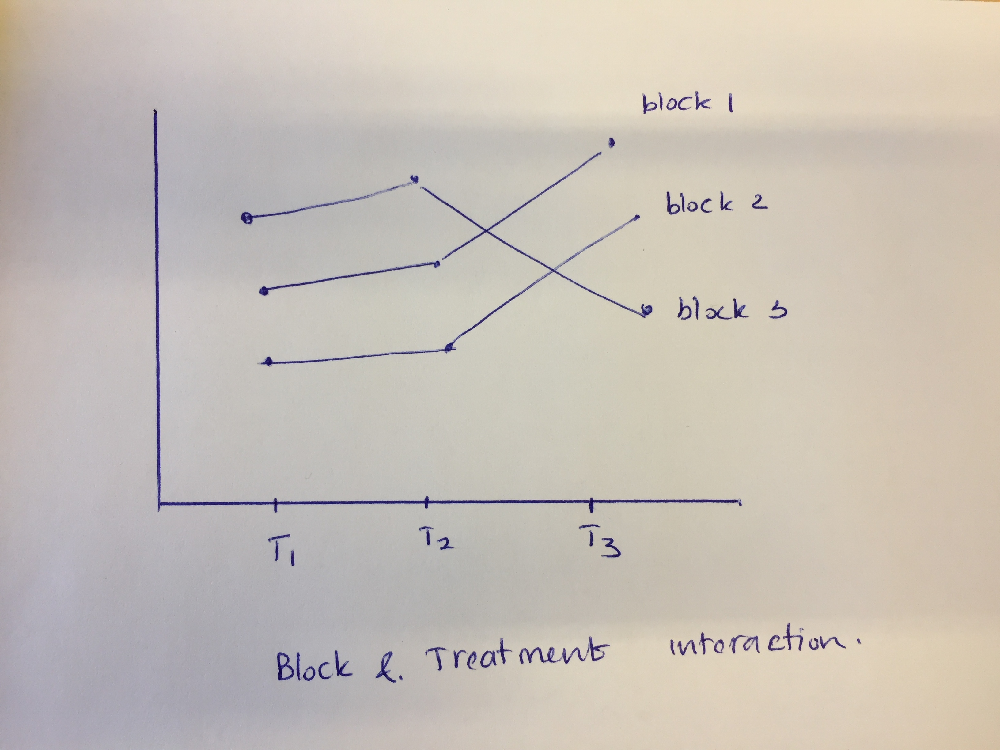

```{r setup, include=FALSE}
knitr::opts_chunk$set(echo = TRUE, fig.width = 5, fig.height = 5, fig.align="center",message=FALSE, warning=FALSE, out.width = '70%')
```

#  Recall

##
- One sample sign test, Wilcoxon signed rank test, large-sample approximation, median, Hodges-Lehman estimator, distribution-free confidence interval.
- Jackknife for bias and standard error of an estimator.
- Bootstrap samples, bootstrap replicates.
- Bootstrap standard error of an estimator.
- Bootstrap percentile confidence interval.
- Hypothesis testing with the bootstrap (one-sample problem.)
- Assessing the error in bootstrap estimates.
- Example: inference on ratio of heart attack rates in the aspirin-intake group to the placebo group.
- The exhaustive bootstrap distribution.


##
- Discrete data problems (one-sample, two-sample proportion tests, test of homogeneity, test of independence).
- Two-sample problems (location problem - equal variance, unequal variance, exact test or Monte Carlo, large-sample approximation, H-L estimator, dispersion problem, general distribution).
- Permutation tests (permutation test for continuous data, different test statistic, accuracy of permutation tests).
- Permutation tests (discrete data problems, exchangeability.)
- Rank-based correlation analysis (Kendall and Spearman correlation coefficients.)
- Rank-based regression (straight line, multiple linear regression, statistical inference about the unknown parameters, nonparametric procedures - does not depend on the distribution of error term.)
- Smoothing (density estimation, bias-variance trade-off, curse of dimensionality)
- Nonparametric regression (Local averaging, local regression, kernel smoothing, local polynomial, penalized regression)

## 
- Cross-validation, Variance Estimation, Confidence Bands, Bootstrap Confidence Bands.
- Wavelets (wavelet representation of a function, coefficient estimation using Discrete wavelet transformation, thresholding - VishuShrink and SureShrink).
- One-way layout (general alternative (KW test), ordered alternatives)
- Two-way layout (compelete block design (Friedman test))
 

# ANOVA (Analysis of variance)

# The Two-Way Layout

## The Two-Way Layout
- Two factors $A$ (treatment factor) and $B$ (blocking factor).
    - $A$ has $k$ levels.
    - $B$ has $n$ levels.
    - primary interest is on factor $A$.
- Primary interest is about the relative locations (medians) of three or more populations ($k$ populations) within each of the homogeneous groups.
- Data: Randomized complete block design (RCBD), Randomized block design (RBD), no observations in some blocks (Balanced incomplete block design), at least one observations in each cell.
        
## The Two-Way Layout   

\begin{table}
        \centering
        \begin{tabular}{l l l l l}
        &\multicolumn{4}{c}{Treatments}\\
        \hline
        Blocks & 1 & 2 & $\cdots$ & k \\
        \hline
        1 & $X_{111}$ & $X_{121}$ & $\cdots$ &  $X_{1k1}$\\
          & $\vdots$ & $\vdots$ &  &  $\vdots$\\
          & $X_{11c_{11}}$ & $X_{12c_{12}}$ & $\cdots$ &  $X_{1kc_{1k}}$\\
        2 & $X_{211}$ & $X_{221}$ & $\cdots$ &  $X_{2k1}$\\
          & $\vdots$ & $\vdots$ &  &  $\vdots$\\
          & $X_{21c_{21}}$ & $X_{22c_{22}}$ & $\cdots$ &  $X_{2kc_{2k}}$\\
        & $\vdots$ & $\vdots$ &  &  $\vdots$\\
        
        n & $X_{n11}$ & $X_{n21}$ & $\cdots$ &  $X_{nk1}$\\
        & $\vdots$ & $\vdots$ &  &  $\vdots$\\
        & $X_{n1c_{n1}}$ & $X_{n2c_{n2}}$ & $\cdots$ &  $X_{nkc_{nk}}$\\
        \hline
        \end{tabular}
        \end{table}

## The Two-Way Layout   

- $N = \sum_{i=1}^{n}\sum_{j=1}^{k}c_{ij}$ observations. 
- $c_{ij}$ - observations from the combination of the $i$-th block with the $j$-th treatment.
- $X_{ijc_{ij}}$ - $c_{ij}$-th response from the combination of the $i$-th block with the $j$-th treatment.
- Assumptions:
    - $N$ random variables are mutually independent.
    - $c_{ij}$ random variables are a random sample from a continuous distribution $F_{ij}$.
    - $F_{ij}\left(u\right) = F\left(u - \beta_{i} - \tau_{j} \right)$
 
## The Two-Way Layout   

- The two-way layout model is $$X_{ijt} = \theta + \beta_{i} + \tau_{j} + e_{ijt}, i = 1, \cdots, n, j = 1, \cdots, k, t = 1, \cdots, c_{ij}.$$

## Randomized complete block design (HWC 7.1 -7.5)

- Single observation for every treatment–block combination.
- Could be the actual data or summarized data for each cell.
- $c_{ij} =1, \forall i,j.$ 
\begin{table}
        \centering
        \begin{tabular}{l l l l l}
        &\multicolumn{4}{c}{Treatments}\\
        \hline
        Blocks & 1 & 2 & $\cdots$ & k \\
        \hline
        1 & $X_{11}$ & $X_{12}$ & $\cdots$ &  $X_{1k}$\\
          
        2 & $X_{21}$ & $X_{22}$ & $\cdots$ &  $X_{2k}$\\
          
        & $\vdots$ & $\vdots$ &  &  $\vdots$\\
        
        n & $X_{n1}$ & $X_{n2}$ & $\cdots$ &  $X_{nk}$\\
        \hline
        \end{tabular}
        \end{table}
- $\text{H}_{0}: \left[\tau_{1} = \tau_{2} = \cdots = \tau_{k}  \right]$ versus $\text{H}_{A}: \left[\tau_{1},\tau_{2} ,\cdots,  \tau_{k} \hspace{.1in} \text{not all equal}\right]$.

## Randomized complete block design (Friedman test)
- Friedman (1937) statistic $S$ $$S = \dfrac{12n}{k(k+1)}\sum_{j=1}^{k}\left(R_{.j} - \dfrac{k+1}{2} \right)^{2},$$ where $R_{.j} = \dfrac{R_{j}}{n}$ and $R_{j} = \sum_{i=1}^{n}r_{ij}$, sum of the ranks in treatment $j$.

## Randomized complete block design (large-sample test, ties)
- Large-sample test
    - As $n \to \infty$  (number of blocks increases), $$S \sim \chi^{2}_{k-1}.$$
- Ties
    - When there are ties, an exact test is only approximate.
    - Modification needed for the test statistic in large-sample approximation. 

## Randomized complete block design (Example)
- Example 7.1 (HWC, page 293)
- Data from a study to determine which, if any, of three methods of rounding first base is best (round out, narrow angle, wide angle).
- This will give information on the average, the time to reach second base (minimizes).
- Each subject is a block.
    - Number of blocks $n = 22$.
    - We can use large-sample approximation.
    
## Randomized complete block design (Example)
```{r}
library(magrittr)
library(NSM3)
library(dplyr)
library(tidyr)
data("rounding.times")
df  = rounding.times %>% data.frame
colnames(df) = paste0("Method_", 
  seq(1,3))
df = mutate(df, block = seq(1, dim(df)[1]))
df = gather(df, key = "Method", value = "xij", c(1:3))
friedman.test(df$xij, df$Method, df$block)
```

## Randomized complete block design (Example)
- We reject $\text{H}_{0}$ based on the Friedman test.

- Large-sample approximation
    - $S = 11.14$.
    - degrees of freedom $k - 1 = 2.$
```{r}
round(1 - pchisq (11.14, 2), digits = 3)
```

- Using the large- sample procedure adjusted for ties, we reject $\text{H}_{0}$.
- We reject the hypothesis that the methods are equivalent with respect to time to reach second base.

## RCBD (Ordered alternative)

- HWC Chapter 7.2 (Page test statistic).
- Appropriate when there is an increasing treatment effects.
    - treatments corresponding to quality or quantity of materials,
    - severity of disease, 
    - drug dosage levels, 
    - intensity of stimulus.
    
## Multiple comparison (RCBD)
- Two-sided all treatments.
- Approximately distribution-free multiple comparison procedures based on signed ranks.

```{r}
library(BSDA)
p.value12 = SIGN.test(x = c(rounding.times[,1]-
    rounding.times[,2]), 
  alternative = "two.sided")$p.value
p.value13 = SIGN.test(x = c(rounding.times[,1]-
    rounding.times[,3]), 
  alternative = "two.sided")$p.value
p.value23 = SIGN.test(x = c(rounding.times[,2]-
    rounding.times[,3]), 
  alternative = "two.sided")$p.value
```

## Multiple comparison (RCBD)
```{r}
round(c(p.value12, p.value13, p.value23), digits = 3)
round(p.adjust(c(p.value12, 
  p.value13, p.value23), method = "holm"), digits = 3)
```


At an approximate experiment-wise error rate of .05, we have reached the conclusion that the round out ($\tau_{1}$) and wide angle ($\tau_{3}$) and narrow angle ($\tau_{2}$) and wide angle ($\tau_{3}$) running methods yield significantly different median times to second base.

## Multiple comparison (treatments versus control)

- Daly and Cooper (1967) considered the rate of stuttering adaptation under three conditions.
    - no electroshock
    - electroshock was administered during each moment of stuttering (Shock following)
    - electroshock was administered immediately fol- lowing each stuttered word (Shock during)
- determine if either of the two treatments yield improved (larger) median adaptation scores
```{r}
data("adaptation.scores")
df  = adaptation.scores %>% data.frame
colnames(df) = c("no.electroshock", 
  "Shock.following", "Shock.during")
df = mutate(df, block = seq(1, dim(df)[1]))
df = gather(df, key = "Conditions", 
  value = "xij", c(1:3))
```

## Multiple comparison (treatments versus control)
```{r}
friedman.test(df$xij, df$Conditions, df$block)
```

- We do not have enough evidence to conclude that at least one of the conditions is different from no electroshock condition.
- We do not need to do the multiple comparison.

## Multiple comparison (treatments versus control)

- Let's do the multiple comparison for the sake of illustration for the multiple comparison (one-sided treatments versus control).
- Approximately distribution-free multiple comparison procedures based on signed ranks.

```{r}
p21 = SIGN.test(x = c(adaptation.scores[,2]-
    adaptation.scores[,1]), 
  alternative = "greater")$p.value
p31 = SIGN.test(x = c(adaptation.scores[,3]-
    adaptation.scores[,1]), 
  alternative = "greater")$p.value
c(p21, p31)
```

## Multiple comparison (treatments versus control)

```{r}
p.adjust(c(p21, p31), method = "holm")
```

- At an experiment-wise error rate of .05, we find no statistical evidence that either of the two electroshock treatments lead to an increase in median adaptation scores over the control setting.

## Randomized balanced incomplete block design (BIBD)
- General alternative: HWC Chapter 7.6.
- Multiple comparison (two-sided): HWC Chapter 7.7.

## Randomized block design (HWC 7.9 -7.10)

- $c_{ij} = c > 1 \forall i,j.$ thus, $N = nkc.$
- $\text{H}_{0}: \left[\tau_{1} = \tau_{2} = \cdots = \tau_{k}  \right]$ versus $\text{H}_{A}: \left[\tau_{1},\tau_{2} ,\cdots,  \tau_{k} \hspace{.1in} \text{not all equal}\right]$.
- Friedman ranks
    - Order the $k$ observations from least to greatest separately within each of the n blocks.
- Mack - Skillings test (MS).
- The large-sample test 
    - As $nc \to \infty$, $\text{MS} \sim \chi^{2}_{k-1}$.


## Randomized block design (Example)
- Example 7.9: Determination of Niacin in Bran Flakes.
- Tnvestigate the precision and homogeneity of a procedure for assessing the amount of niacin in bran flakes.
- In four different laboratories (number of blocks is 4), bran flakes enriched with 0, 4, or 8 mg niacin per 100 g of cereal.

## Randomized block design (Example)
```{r message=FALSE}
library(Skillings.Mack)
data("niacin")
df = matrix(niacin, nrow=3, 
  byrow=TRUE) %>% t %>% data.matrix()
colnames(df) = paste0("trt", 
  c(0, 4, 8))
Ski.Mack.test = Ski.Mack(df) # df is a data matrix with column treatments and rows blocks.
```

## Randomized block design (Example)

- We can reject $\text{H}_{0}$ at the $\alpha = .05$ level, providing rather strong evidence that the studied process for assessing niacin content in bran flakes does not produce consistent results across a variety of laboratories and is therefore not reliable as an evaluative procedure. 


## Median Polish
- To find an additively-fit model for data in a two-way layout table - John Tukey [reference here](https://en.wikipedia.org/wiki/Median_polish).
    - Overall median $+$ row effect $+$ column effect.
- Use rows and columns medians to compute the row and column effect.

## Median polish procedure

- Step 1
    - Compute overall median. 
    - Compute the residual table: observed - overall median.
    - Set row and column effect to zero.

- Step 2
    - Compute the row medians, including for column effect row.

- Step 3
    - Create residual table from row medians
        - Add row medians to row effect.
        - Subtract row median from last set of residuals.

- Step 4
    - Compute the column medians, including for the row effect.

- Step 5
    - Create a residual table from column medians.
        - Add column medians to column effect.
        - Subtract column median from last set of residuals.
        
- Repeat (1)-(5) until negligible change occur with row or column medians (effect).

## Median polish procedure (Example)

- Infant mortality rates in the United States 1964-1966 by region
and father’s education.
- Cell entries are number of deaths (under one year old) per 1000
live births.
```{r}
df = data.frame(ed8 = c(25.3, 32.1, 38.8, 25.4), 
  ed9to11 = c(25.3, 29, 31, 21), 
  ed12 = c(18.2,18.8,19.3,20.3), 
  ed13to15 = c(18.3,24.3,15.7,24), 
  ed16 = c(16.3, 19, 16.8, 17.5))
rownames(df) = c("NE", "NC", "S", "W")
df  
```

## Cleveland Dot Plot
- A simple plot 
```{r fig.show='hide'}
df  = df %>% as.matrix()
dotchart(df)
```

- Within fathers educated up to 6th grade category, the largest infant mortality is observed in the Southern USA.
- The group with fathers educated 16 years or more has the least infant mortality.


## Cleveland Dot Plot
```{r echo=FALSE}
dotchart(df)
```

##
```{r echo=FALSE}
df  = df %>% t()
dotchart(df)
```


## Boxplot
```{r }
library(ggplot2)
df = data.frame(ed8 = c(25.3, 32.1, 38.8, 25.4), 
  ed9to11 = c(25.3, 29, 31, 21), 
  ed12 = c(18.2,18.8,19.3,20.3), 
  ed13to15 = c(18.3,24.3,15.7,24), 
  ed16 = c(16.3, 19, 16.8, 17.5))
rownames(df) = c("NE", "NC", "S", "W")
df.edu  = gather(df, key = "Education_level")
df.edu   = mutate(df.edu, 
  Education_level = factor(Education_level, 
    levels = c("ed8", "ed9to11", "ed12", "ed13to15", "ed16")))
df.region = df %>% as.matrix() %>% 
  t %>% data.frame %>% gather(key = "Region")
df.region = mutate(df.region, 
  Region = factor(Region))
```

## Boxplot

```{r echo=FALSE, fig.width=8}
library(gridExtra)
p1 = ggplot(data = df.edu) + 
  geom_boxplot(aes(x = Education_level, y = value)) +
  xlab("Education level") + ylab("Infant mortality")
p2 = ggplot(data = df.region) + 
  geom_boxplot(aes(x = Region, y = value)) + 
  ylab("Infant mortality")
grid.arrange(p1, p2, ncol = 2)
```

## Median polish 

- We can represent the infant mortality rate using 4 components: overall median, median between education level, median between region, difference between each mortality and the difference.
- We can compare infant mortality rate between education level, region and both education and region.
- Additive model $$X_{ij} = \theta + \beta_{i} + \tau_{j} + e_{ij}, i = 1, \cdots, n, j = 1, \cdots, k.$$
- $\theta$: overall median.
- $\beta_{i}$: row effect (region).
- $\tau_{i}$ - column effect (fathers' number of years of education).
- $e_{ij}$ - residuals

##
```{r}
df
```


## 
- Step 1
    - Compute overall median. 
    - Compute the residual table: observed - overall median.
    - Set row and column effect to zero.
```{r}
overall.median = median(as.matrix(df)); overall.median 
```
    
```{r}
df  = df - overall.median
df  = cbind(rowEff = c(rep(0,4)), df)
df  = rbind(c(rep(0,4)), df); rownames(df)[1] = "colEff"
df[1,1] = overall.median; df
```


##
- Step 2
    - Compute the row medians, including for column effect row.
    
```{r}
rowMed = apply(df[c(1:5), c(2:6)], 1, median); rowMed
```

##
- Step 3
    - Create residual table from row medians
        - Add row medians to row effect.
        - Subtract row median from last set of residuals. 
```{r}
df[, 1] = df[, 1] + rowMed
df[c(2:5), c(2:6)] = df[c(2:5), c(2:6)] - rowMed[-1]; df
```

##
- Step 4
    - Compute the column medians, including for the row effect.
```{r}
colMed = apply(df[c(2:5), c(1:6)], 2, median); colMed 
```

## 
- Step 5
    - Create a residual table from column medians.
        - Add column medians to column effect.
        - Subtract column median from last set of residuals.
```{r}
df[1, ] = df[1, ] + colMed
df[c(2:5), ] = sweep(df[c(2:5), ], 2, colMed);df
```

##
- That completes the first smoothing iteration.
    - We can continue the iteration until the row median and column median are zero or relatively small change to the previous iteration.
  
## 
- Let us do the second iteration:
```{r}
df = data.frame(ed8 = c(25.3, 32.1, 38.8, 25.4), 
  ed9to11 = c(25.3, 29, 31, 21), 
  ed12 = c(18.2,18.8,19.3,20.3), 
  ed13to15 = c(18.3,24.3,15.7,24), 
  ed16 = c(16.3, 19, 16.8, 17.5))
rownames(df) = c("NE", "NC", "S", "W")

med.polish2 = medpolish(df , maxiter = 2)
```

##
```{r}
med.polish2$overall
med.polish2$row
med.polish2$col
med.polish2$residuals
```


## 
- row and column effects are not really close to zero.
- Let's do the third iteration.
```{r}
med.polish3 = medpolish(df , maxiter = 3)
```

##
```{r}
med.polish3$overall
med.polish3$row
med.polish3$col
med.polish3$residuals
```


##
- `medpolish` can determine the number of iteration until convergence. For our example, convergence is reached at the fourth iteration.
```{r }
library(reshape2)
med.polish = medpolish(df)
med.polish.res = med.polish$residuals
# add row effect and column effect to the residual table
med.polish.res = cbind(rowEff = med.polish$row, 
  med.polish.res)
med.polish.res  = rbind(c(med.polish$overall, 
  med.polish$col), 
  med.polish.res)
rownames(med.polish.res)[1] = "colEff"
colnames(med.polish.res)[1] = "rowEff"

```

##
```{r }
med.polish.res
med.polish.res.long = melt(med.polish.res)
```

##
```{r}
p = ggplot(med.polish.res.long, 
  aes(x  = Var2, y = Var1)) + 
  geom_tile(aes(fill = value, label = value)) +
  geom_text(aes(label = round(value, 1))) +
  scale_fill_gradient(low="grey90", high="red") +
  labs(x="Education", y="Region", 
    title="Infant mortality") + theme_bw() + 
  theme(axis.text.x=element_text(size=9, 
    angle=0, vjust=0.3),
    axis.text.y=element_text(size=9), 
    plot.title=element_text(size=11, 
      hjust = 0.5), legend.position="none")
```

##
```{r echo=FALSE}
p
```
- Overall median contributing to the largest effect.
- Abnormal large residual in Southern region with 8th grade education of father. 

## Interpretation of median polish results
```{r echo=FALSE}
library(png)
library(grid)
img <- readPNG("median.polish.results.png")
grid.raster(img)
```


## Interpretation of median polish results

- Additive model $$X_{ij} = \theta + \beta_{i} + \tau_{j} + e_{ij}, i = 1, \cdots, n, j = 1, \cdots, k.$$
- For example, $X_{11} = 25.3$, $\theta = 20.8$, $\beta_{1} = -1.5$, $\tau_{1} = 7.5$, $e_{11} = -1.5$.
    - That gives, $25.3 \approx  20.8  -1.5 + 7.5 - 1.5$.
- The largest infant mortality rate is observed for fathers who did not attain more than 8 years of school.
- The least infant mortality rate is observed for fathers who has completed more than 16 years of school.
- Note for median polish:
    - We can use mean instead of median.
    - If we use mean, then there is no iterations.
    - The row and column effects are regression coefficients.

## Tukey additivity plot
- Check whether additive model is appropriate.
-  Plot residuals versus the comparison value, $\text{cv}_{ij}$, defined as $\dfrac{\beta_{i} \tau_{j}}{\theta}.$
    - If there is no pattern in the plot, then the additive model is appropriate.
 
## Tukey additivity plot   
```{r}
plot(med.polish)
```


## Tukey additivity plot 
- If there is a trend observed, it's slope could be used to define the transformation of the data: $X_{ij}^{1-\text{slope}}$.
- If the transformation is not appropriate, then add $\text{cv}_{ij}$ to the model.

## Profile plots
- Identifying interaction between treatment and blocking factors.




##  References for this lecture

**HWC** Chapter  7 

**CS 2016** [Lecture notes on introduction to nonparametric](http://christofseiler.github.io/stats205/Lecture18/ANOVA.pdf).

**Manny Gimond 2019** [Lecture notes on Median polish and Tukey additivity plot](https://mgimond.github.io/ES218/Week11a.html).

Homework 7 Page 301, Problem 1
Goldsmith and Nadel (1969) have studied respiratory function following exposure
to various levels of ozone for periods of 1 h. The subjects were four presumably
healthy males employed by the California State Department of Public Health. The
objective measurement used was airway resistance as evaluated by the body
plethysmographic technique (see DuBois et al. (1956) and Comroe, Botelho, and
DuBois (1959)). Goldsmith and Nadel reported average val- ues for four
consecutive measurements taken immediately prior to and again about 5 min after
termination of each level of ozone exposure. **Table 7.2** is based on a subset
of the Goldsmith- Nadel data, where the tabled values are average airway
resistance after ozone exposure minus average airway resistance prior to ozone
exposure. Use Friedman's test procedure to test $\text{H}_{0}$. What is the null
and alternative hypothesis? What are your conclusions?
Homework 7 Page 321, Problem 31
Apply multiple comparison procedure to the ozone exposure data of Table 7.2.
Homework 7: Perform median polish on Table 7.2. What are you conclusions? Do
model fit evaluations using Tukey additivity plot. What are your conclusions?