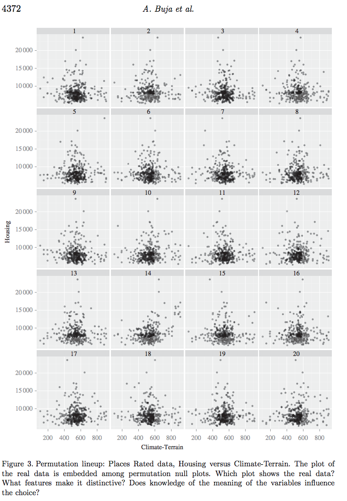
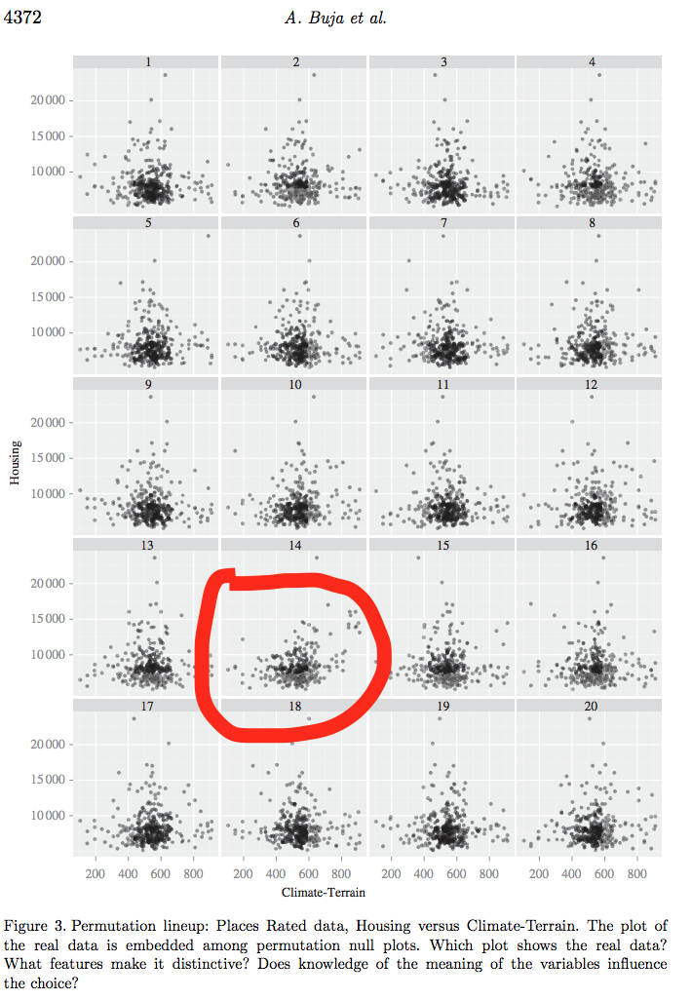
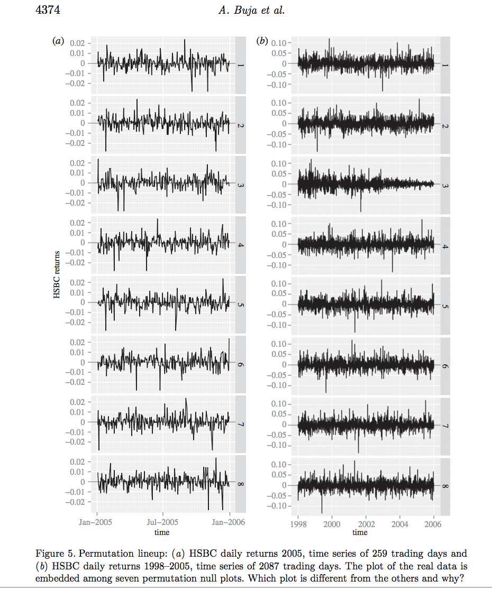
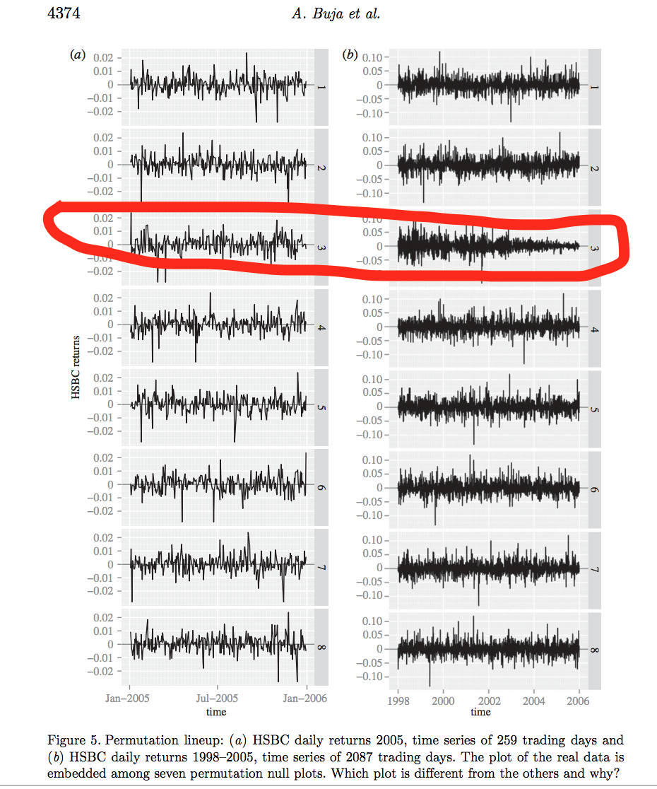
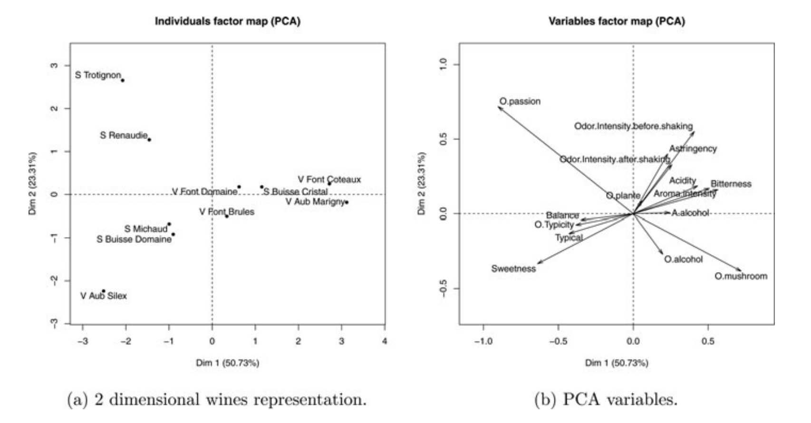

```{r setup, include=FALSE}
knitr::opts_chunk$set(echo = TRUE, fig.width = 5, fig.height = 5, fig.align="center",message=FALSE, warning=FALSE, out.width = '70%')
```

#  Recall

##
- One sample sign test, Wilcoxon signed rank test, large-sample approximation, median, Hodges-Lehman estimator, distribution-free confidence interval.
- Jackknife for bias and standard error of an estimator.
- Bootstrap samples, bootstrap replicates.
- Bootstrap standard error of an estimator.
- Bootstrap percentile confidence interval.
- Hypothesis testing with the bootstrap (one-sample problem.)
- Assessing the error in bootstrap estimates.
- Example: inference on ratio of heart attack rates in the aspirin-intake group to the placebo group.
- The exhaustive bootstrap distribution.


##
- Discrete data problems (one-sample, two-sample proportion tests, test of homogeneity, test of independence).
- Two-sample problems (location problem - equal variance, unequal variance, exact test or Monte Carlo, large-sample approximation, H-L estimator, dispersion problem, general distribution).
- Permutation tests (permutation test for continuous data, different test statistic, accuracy of permutation tests).
- Permutation tests (discrete data problems, exchangeability.)
- Rank-based correlation analysis (Kendall and Spearman correlation coefficients.)
- Rank-based regression (straight line, multiple linear regression, statistical inference about the unknown parameters, nonparametric procedures - does not depend on the distribution of error term.)
- Smoothing (density estimation, bias-variance trade-off, curse of dimensionality)
- Nonparametric regression (Local averaging, local regression, kernel smoothing, local polynomial, penalized regression)

## 
- Cross-validation, Variance Estimation, Confidence Bands, Bootstrap Confidence Bands.
- Wavelets (wavelet representation of a function, coefficient estimation using Discrete wavelet transformation, thresholding - VishuShrink and SureShrink).
- One-way layout (general alternative (KW test), ordered alternatives), multiple comparison procedure.
- Two-way layout (complete block design (Friedman test)), multiple comparison procedure, median polish, Tukey additivity plot, profile plots.
- Better bootstrap confidence intervals (bootstrap-t, percentile interval, BCa interval, ABC interval).
 
# Inference for data visualization

## Overview

- Visualization for
    - exploratory data analysis (to search for structure/pattern in the data)
    - model diagnostics (to search for structure not captured by the fitted model)
- `Magical thinking`: natural human inclination to over-interpret
connections between random events [@thinking1985]

## Overview
- Which plot shows the higher degree of association? (left/right)
```{r echo=FALSE}
library(ggplot2)
library(gridExtra)
x = rnorm(100, mean = 10, sd  = 1.5)
y = x + rnorm(n = 100)
df = data.frame(x = x, y = y)
p1 = ggplot(df) + geom_point(aes(x = x, y = y)) + 
  xlim(c(5, 15)) + ylim(c(5, 15))
p2 = ggplot(df) + geom_point(aes(x = x, y = y)) + 
  xlim(c(0, 25)) + ylim(c(0, 30))
grid.arrange(p1,p2, nrow =1)
```

## 
- Reference [@thinking1985]
- Scale does change the perception of a viewer.
- We can use some protocols to check whether a pattern in the data arise by chance.

# Inference for plots

## Inference for plots
- Reference [@buja2009]
- 'The lineup' protocol:
    - Generate 19 null plots (assuming that structure is absent.)
    - Arrange all 19 plots and insert the plot from real data at random location.
    - Ask human viewer to single out the real plot.
    - Under the null hypothesis that all plots are the same, there is a one in 20 chance to single out the real one.
    - If the viewer chooses the plot of the real data, then the
discovery can be assigned a p-value of 1/20 = 0.05
    - Larger number of null plots could yield a smaller p-value.
      - But there is a limit of how many plots a human can consider.

## Inference for plots
-  Repeat the above 'the lineup' protocol with $K$ independently
recruited viewers.
    -  Let $X$ be the number of viewers choose the real data plot.
    -  Suppose $k \leq K$ selected the plot of the real
    data.
        - p-value $=P\left(X \geq k \right),$ where $X \sim \text{binomial}\left(n=K, p = 1/20 \right)$.
        - If all the viewers picked the real data plot, p-value is $.05^{K}$.
    
## Inference for plots (Example)
- Scatter plot. 
- Null hypothesis: the two variables are independent
    - null data sets can be produced by permuting
the values of one variable against the other.

## Inference for plots (Scatter plot Example)
- Cities across the USA were rated in 1984 according to many features (Boyer \& Savageau (1984)).
    - census data, not a random sample.
- Consider ‘Climate-Terrain’ and ‘Housing' variables.
    - Climate-Terrain: low values - uncomfortable temperatures, higher values - moderate temperatures.
    - Housing: a higher cost of owning a
single family residence
- Expected association: more comfortable climates call for higher average housing costs.

## Inference for plots (Scatter plot Example)


## Inference for plots (Scatter plot Example)


## Inference for plots (Scatter plot Example)

```{r}
# number of students
K = 8
# number of correct picks
k = 2
pvalue = sum(dbinom(k:K,K,1/20)); pvalue
```

- We reject the null hypothesis that Housing is independent of Climate-Terrain.

## Inference for plots (time series plot example)
- HSBC (‘The Hongkong and Shanghai Banking Corporation’) daily stock returns (two panel data)
    - 2005 return only.
    - 1998–2005 return.
- In each panel, select which plot is the most
different and explain why.

## Inference for plots (time series plot example)

  
## Inference for plots (time series plot example)


## Inference for plots (time series plot example)
```{r}
# number of students
K = 8
# number of correct picks
k = 4
pvalue = sum(dbinom(k:K,K,1/8)); pvalue
```

## Inference for plots (time series plot example)
- In 2005 return data, the viewer should have had difficulty selecting the real data plot.
    - This is the year of low and stable volatility in return.
- In 1998–2005 return data, it should be easy.
    - There are two volatility bursts.
        - In 1998 due to the Russian bond default and the LTCM (long-term capital management)
collapse.
        - In 2001 due to the 9/11 event.
        - Later after 2001, volatility stabilizes at a low level.

# Principal component analysis (PCA)

## PCA
- PCA is primarily an exploratory tool.
- PCA finds a low-dimensional subspace that minimizes the  distances between projected points and subspace.
- Consider observations $\vx_{1}, \vx_{2}, \cdots, \vx_{n}$ - each $\vx_{i}$ is a $p$ column vector.
- Combine $\vx_{i}$s in a matrix $\mX$ with dimension $n \times p$.
- Start by recentering $X$, from now on consider $X$ centered i.e. $\vone_{n} X=0$.
- PCA finds $U$, $S$, and $V$ matrices such that $X = \mU \mS \mV^{T}$ (Singular value decomposition - SVD).
    - Columns of $\mV$ are new variables.
    - Principal components $\mC = \mU \mS$.
    
## PCA
- PCA as an optimization problem.
    - The first column vector $\vv_{1}$ of $\mV$ is such that $\langle \vv_{1} \,, \vv_{1} \rangle = 1$ and $$\hat{\vv}_{1} = \underset{\vv_{1}}{\text{maximize}} \left\lbrace \V \left(\mX \vv_{1} \right)\right\rbrace.$$
    - Find $\vv_{2}$ such that $\langle \vv_{1} \,, \vv_{2} \rangle = 0$, $\langle \vv_{2} \,, \vv_{2} \rangle = 1$, and $$\hat{\vv}_{2} = \underset{\vv_{2}}{\text{maximize}}  \left\lbrace \V \left(\mX \vv_{2} \right)\right\rbrace.$$
- Keep going the same way until $\vv_{1}, \vv_{2}, \cdots, \vv_{q}$ have been collected and put them in $\hat{\mV}$ of dimensions $p \times q$.

## Bootstrap PCA

- Two ways to bootstrap PCA in case of random rows $\mX$
    - Partial bootstrap.
    - Total bootstrap.
- Partial bootstrap:
    - Project $B$ replications onto initial subspace.
    - Initial subspace is obtained by PCA on original $\mX$.
    - Underestimates variation of parameters [@milan1995].
- Total bootstrap:
    - Perform new PCA on each replication.
    - Nuisance variations in PCA on bootstrap samples: reflections and rotations
    - Align PCAs on bootstrap samples.
    

## Bootstrap PCA (need of Procrustes analysis)
- For the total bootstrap, need to align PCAs of bootstrap samples.
- This is usually done using Procrustes analysis.
- Procrustes refers to a bandit from Greek mythology who made
his victims fit his bed by stretching their limbs (or cutting them
off)
- Procrustes analysis is used in statistical shape analysis to
align shapes and minimize difference between shapes to retain real shape (by removing nuisance parameters):
    - translation in space
    - rotation in space
    - sometimes scaling of the objects


## Bootstrap PCA (need of Procrustes analysis)
- Shapes are different by rotation, translation, and scaling.


- We need to remove translation, rotation, and scaling effects before comparing shapes of the spinal code defined by the landmarks (red points).

## Bootstrap PCA (need of Procrustes analysis)
- In PCA, shapes are the projected points onto the lower
dimensional subspace spanned by say PC1 and PC2.
```{r echo=FALSE}
library(png)
library(grid)
img <- readPNG("procruster_analysis.png")
grid.raster(img)
```

- Procrustes rotations of the rows of the PCA estimators onto the initial configuration. The first table corresponds to $\mX$ and the other to $\hat{\mX}^{*b}, b = 1, \cdots, B.$

## Bootstrap PCA

- Collecting $B$ bootstrap sampled PCAs by resampling rows of
data matrix $\mX$ $$\mV^{*1}_{q}, \mV^{*2}_{q}, \cdots \mV^{*B}_{q}.$$
- Align all the projected point set using Procrustes alignment.
    - Find the rotation for each bootstrap replicates $$\hat{R}^{b} = \underset{R}{\text{minimize}} \left\lbrace \left|\left| \mX^{*1}\mV^{*1}_{q} - \mX^{*b}\mV^{*b}_{q}R\right|\right|\right\rbrace.$$
    - Apply the rotation to projected data point for each bootstrap sample $$X^{*b} \mV^{*b}_{q}\hat{R}^{b}.$$
- Overlay points and draw contours around it.
- \rc  This nonparamteric bootstrap approach modify the structure of the rows of $\mX$ for each bootstrap replication. \bc

## Parametric bootstrap PCA
- In case of fixed rows and columns $X$, we can use parametric
bootstrap.
    - Perform PCA on $\mX$ to estimate $\hat{\mV}_{q}$.
    - Estimate residual $\sigma^{2}$ from the residual matrix $\mE = X - \hat{\mV}_{q}\hat{\mV}_{q}^{T}\mX$
    - Draw $\epsilon_{ij} \sim \text{N}\left(0,  \hat{\sigma}^{2}\right)$.
    - Generate new matrix $X^{*b} = \hat{\mV}_{q}\hat{\mV}_{q}^{T}\mX+\mE^{*b}$.
    - Perform PCA on $X^{*b}$.

## Parametric bootstrap PCA (Example)
- Consumers describe 10 white wines with 14 sensory attributes.
- Consumers score wines between 1 and 10 for each attribute.
- Collect averages across consumers in $10 \times 14$ matrix $\vX$.

```{r}
library(SensoMineR)
data(napping)
data(napping.words)
library(ade4)
library(magrittr)
library(dplyr)
df = napping.words 
wine.pca = dudi.pca(df, scannf = F, nf = 3)
row.scores = data.frame(li = wine.pca$li, 
  SampleCode = rownames(df))
row.scores = row.scores %>%
  left_join(data.frame(SampleCode = rownames(df)))
evals.prop = 100 * (wine.pca$eig / sum(wine.pca$eig))
```


## Parametric bootstrap PCA (Example)
```{r}
evals = wine.pca$eig
p = ggplot(data = row.scores, aes(x = li.Axis1,
  y = li.Axis2, label = SampleCode, col = SampleCode)) + 
  geom_point(size = 1)  +
  geom_text(aes(label = SampleCode), 
    hjust=0, vjust=0.1) +
  labs(x = sprintf("Axis 1 [%s%% variance]",
    round(evals.prop[1], 1)), 
       y = sprintf("Axis 2 [%s%% variance]", 
         round(evals.prop[2], 1))) +
  ggtitle("PCA scores for wine data")

```

## Parametric bootstrap PCA (Example)
```{r echo=FALSE}
p + theme_bw() +
  theme(panel.border = element_rect(color = "#787878", 
    fill = alpha("white", 0)), 
    plot.title = element_text(hjust = .5), legend.title = element_text(size = 8), 
    legend.text = element_text(size=8), 
    axis.text = element_text(size = 10),  
    axis.title = element_text(size = 10), 
    legend.position = 'none') + xlim(c(-4, 8))
```

- The first two PCs explained almost 54\% of total variability.

## Parametric bootstrap PCA (Example)
- With the bootstrap confidence ellipses
```{r}

```

## Parametric bootstrap PCA (Example)
- PCA on the wine data set [@josse2016].


## Parametric bootstrap PCA (Example)
- Bootstrap for PCA scores. [@josse2016].
```{r echo=FALSE}
library(png)
library(grid)
img <- readPNG("bootstrap_pca_wine_data.png")
grid.raster(img)
```


## Parametric bootstrap PCA (Notes)
- Read [@josse2016] for confidence areas using jackknife for PCA. 


##  References for this lecture

- **HW2018** [Modern statistics for modern biology](http://web.stanford.edu/class/bios221/book/Chap-Multivariate.html).

- **Christof 2016:** [Lecture notes on inference for visualization](http://christofseiler.github.io/stats205/Lecture24/Visualization.pdf)


##  References for this lecture


