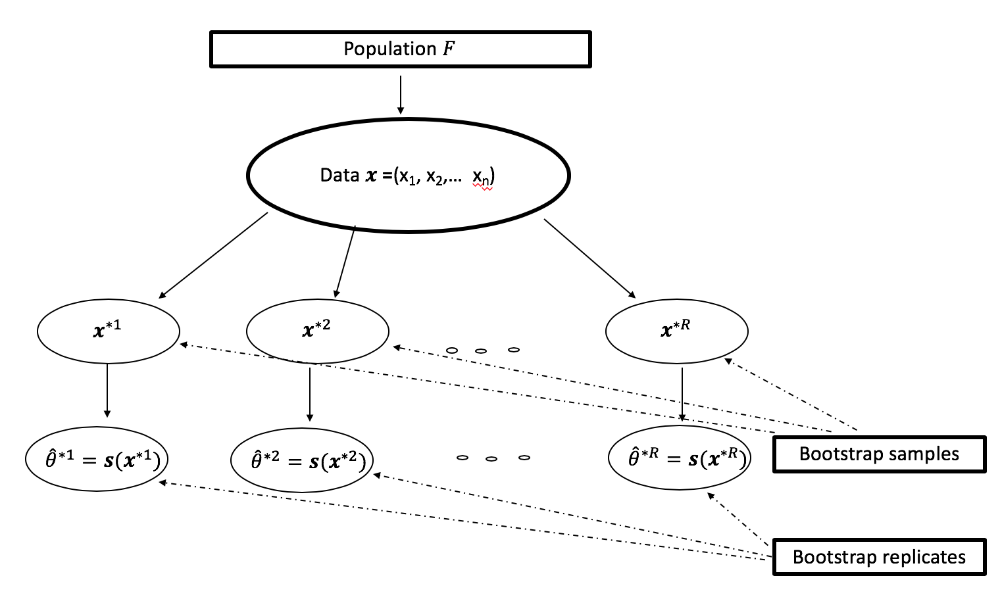
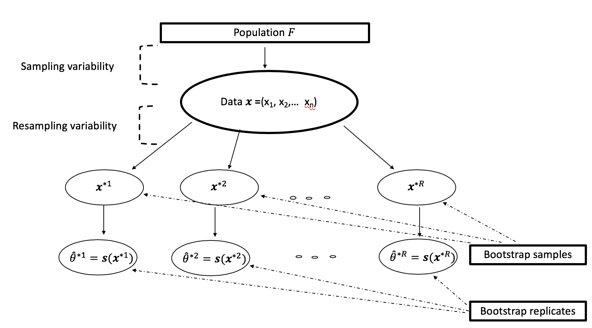

```{r setup, include=FALSE}
knitr::opts_chunk$set(echo = TRUE, fig.width = 3,fig.height = 3,message=FALSE, warning=FALSE)
```

##  Recall

- Testing location parameter.
- Assumptions on $F$, either continuous cdf or symmetric continuous cdf.
- Estimators of location parameters.
- Distribution-free confidence intervals for location parameters.
- Measures of robustness of estimators
    - robustness to the observed data (sensitivity, breakdown point).
    - robustness to the theoretical distribution underlying the data (influence functions).
- Location parameters as statistical functionals.
- Approximates the standard error of a plug-in estimator using influence function.

## The jackknife

- Asymptotic connection between jackknife estimate of variance of an estimator and influence function.
    - Influence function with $\epsilon = \dfrac{-1}{n-1}$, and $\hat{F}$ provides the jackknife estimate of variance as $n \to \infty$
        \begin{equation}
        \begin{split}
          \hat{L}\left(z\right) =& \lim_{n \rightarrow \infty} \dfrac{T\left( \left(1-\dfrac{-1}{n-1}\right)\hat{F} + \dfrac{-1}{n-1} \delta_{z}\right) - T\left(\hat{F}\right)}{\dfrac{-1}{n-1}}\\
                                =& \lim_{n \rightarrow \infty} \dfrac{T\left(\hat{F}_{(i)}\right) - T\left(\hat{F}\right)}{\dfrac{-1}{n-1}},
          \end{split}
        \end{equation}
        where $\hat{F}_{(i)}$ is the empirical cdf with i-th observation removed.
    - $\tau^{2} = \int L\left( z\right)^2 dF\left(z\right)$.
    - $\hat{\tau}^{2} = \dfrac{1}{n}\sum_{i=1}^{n} \left( \hat{L}\left(z\right) \right)^{2}$ provides $\V\left(T\left(\hat{F}\right)\right) =\dfrac{\hat{\tau}^{2}}{n}$.


## The jackknife

- Suppose $\vX = \left(X_{1}, \cdots, X_{n}\right)^{T} \sim F$ a random sample.
      - $\theta = T(F)$, a parameter of interest.
      - $\hat{\theta} = s\left(\vx\right)$, an estimate from $\vx = \left(x_{1}, \cdots, x_{n}\right)^{T}$, the observed data.
      - $s\left(\vx\right)$ may not be a plug-estimate $T\left(\hat{F}\right)$.
- The jackknife method can be used for estimating the bias and standard error of $\hat{\theta} = s\left(\vx\right)$.
    - Let $\vX_{(i)}$ be a random sample with i-th observation removed.
    - Let $\hat{\theta}_{(i)} = s\left(\vx_{(i)}\right)$ be an estimate of $\theta$ with i-th observation removed.
    - Define $\hat{\theta}_{(\cdot)} = \dfrac{\sum_{i=1}^{n}\hat{\theta}_{(i)}}{n}$
    - The jackknife estimate of $\hat{\text{bias}_{\text{jack}}} = \left(n-1\right)\left(\hat{\theta}_{(\cdot)}  - \hat{\theta} \right)$
    - The jackknife estimate of standard error
    $\hat{\text{se}}_{\text{jack}} = \left[\dfrac{n-1}{n} \sum_{i=1}^{n}\left(\hat{\theta}_{(i)} -\hat{\theta}_{(\cdot)}\right)^2 \right]^{1/2}$

## The jackknife

- Jackknife is easier to compute (for $n \approx 200$) than the bootstrap to estimating standard error and bias of an estimator but is less efficient than the bootstrap.
- Jackknife estimate may be inconsistent (example, jackknife estimate of variance of median). 


## The bootstrap

- Computer-based resampling procedure to access the statistical accuracy.
- Computes standard error or bias of a statistic or sampling distribution of a statistic or confidence intervals of parameters.
- No need a mathematical expression for the statistical accuracy such as bias or standard error.


## The bootstrap

- $\vX = \left(X_{1}, \cdots, X_{n}\right)^{T} \sim F$.
- $\theta = T(F)$, a parameter of interest.
- $\hat{\theta} = s\left(\vx\right)$, an estimate from $\vx = \left(x_{1}, \cdots, x_{n}\right)^{T}$.
- Let $\hat{F}$ be the empirical distribution of the observed values $x_{i}$, $\hat{F}\left(t\right) = \dfrac{\sum_{i=1}^{n}I\left(x_{i} \leq t\right)}{n}$.
- A bootstrap sample $\vX^{*} = \left(X_{1}^{*},\cdots, X_{n}^{*} \right)$, a random sample of size $n$ drawn with replacement from $\hat{F}$ (total of distinct bootstrap samples ${2n-1 \choose n-1}$) [see illustration](http://statweb.stanford.edu/~susan/courses/s208/node37.html). 
- A bootstrap replication of $\hat{\theta}$ is $\hat{\theta}^{*} = s\left(\vx^{*}\right)$.
- Bootstrap replicates $\hat{\theta}^{*1}, \cdots, \hat{\theta}^{*R}$, where $R$ is the number of bootstrap samples.


## The bootstrap (illustration)


## The bootstrap method for estimating standard error

- Draw $R$ bootstrap samples $\vX^{*1}, \cdots, \vX^{*R}$ each with $n$ values with replacement.
- Evaluate bootstrap replicate $\hat{\theta}^{*r} = s\left(\vx^{*r} \right)$.
- Estimate the standard error $\text{se}\left(\hat{\theta}\right)$
$$\hat{\text{se}}_{\text{boot}}\left(\hat{\theta}\right) = \left[  \dfrac{\sum_{r=1}^{R}\left(\hat{\theta}^{*r} - \hat{\theta}^{*}(\cdot)\right)^{2}}{R-1}\right] ^{1/2},$$

where $\hat{\theta}^{*}(\cdot) = \dfrac{\sum_{r=1}^{R} \hat{\theta}^{*r}}{R}$.

- How large should be R? The rules of thumb: $R =50$ is often enough to give a good estiamte of $\text{se}\left(\hat{\theta}\right)$ (much larger values of $R$ are required for confidence intervals).

##  Bootstrap percentile confidence interval

- Order bootstrap replicates $\hat{\theta}^{*}_{(1)}, \cdots, \hat{\theta}^{*}_{(R)}$.
- Let $m = \left[\alpha/2 \times R \right]$, $\left[u \right]$ is the largest integer less than or equal to $u$.
- Approximate $\left(1- \alpha\right)100\%$ confidence interval for
$\theta$ is $\left(\hat{\theta}^{*}_{(m)}, \hat{\theta}^{*}_{(R-m)}\right)$.
- Choose $R = 1000$ or larger than 1000.  


## One-sample location problem

- $\vX = \left(X_{1}, \cdots, X_{n}\right)^{T} \sim F$.
- $\vx = \left(x_{1}, \cdots, x_{n}\right)^{T}$ - observed random sample.
- Hypothesis, $\text{H}_{0}: \theta = \theta_{0}$ versus $\text{H}_{a}: \theta > \theta_{0}$.
- Let $T\left(\vX\right)$ be a test statistic (need not be an estimate of a parameter $\theta$). Let $T\left(\vx\right) =\hat{\theta} =\bar{\vx}$.
- We need to take bootstrap samples from
$\lbrace x_{1} - \hat{\theta} + \theta_{0}, \cdots, x_{n} - \hat{\theta} + \theta_{0}  \rbrace$.
- Then
$$\text{P-value} = \dfrac{\#\lbrace \hat{\theta}^{*r} \geq \hat{\theta} \rbrace}{R}.$$


## Assessing the error in bootstrap estimates

- Bootstrap estimates are not exact (nearly unbiased but can have substantial variance).
- Two sources of variability
    - Sampling variability: we have only a sample of size $n$ rather than the entire population.
    - Bootstrap resampling variability: we only take $R$ bootstrap samples rather than total of ${2n-1 \choose n-1}$ distinct bootstrap samples.

## Two sources of variability (illustration)



## Example (Hypothesis)

- Hypothesis: Small aspirin doses would prevent heart attacks in healthy middle-aged men.


## Example (Experiment)

- Controlled, randomized, double-blinded study (both physicians and subjects were blinded the assignment).
- One half of the subjects received aspirin and other half received placebo.
- Define $X_{i} = 1$ if heart attack is observed and $X_{i} = 0$ otherwise.
    
```{r}
labels = c("nattacks","nsubjects")
aspirin = c(104, 11037)
placebo = c(189, 11034)
data = data.frame(aspirin, placebo)
rownames(data) = labels
data
```

## Example (Estimation)
- $\hat{\theta} =$ Ratio of rate of heart attacks in the aspirin group to placebo group.
- $\text{H}_{0}: \theta = 1$ versus $\text{H}_{a}: \theta < 1$
```{r}
ratio = function(r) {r[1]/r[2]}
theta.hat = ratio(data$aspirin)/ratio(data$placebo)
theta.hat
```

This indicates that in this sample the aspirin-takers only have 55\% as many heart attacks as placebo-takers.

## Example

- What is the uncertainty of $\hat{\theta}$?
- Use bootstrap to access the statistical accuracy.

```{r}
sample.aspirin = c(rep(1, 
  times = data["nattacks","aspirin"]),
  rep(0, 
    times = (data["nsubjects","aspirin"] - 
      data["nattacks","aspirin"])))

table(sample.aspirin)
```

## Example
```{r}
sample.placebo = c(rep(1, 
  times = data["nattacks","placebo"]), 
  rep(0, 
    times = (data["nsubjects","placebo"] - 
        data["nattacks","placebo"])))

table(sample.placebo)
```

## Example (bootstrap samples)

- Draw bootstrap samples and compute bootstrap replicates.
```{r}
bootstrap.sample = function() {
  boot.sam.aspirin = sample(sample.aspirin, 
    replace = TRUE)
  boot.sam.placebo = sample(sample.placebo, 
    replace = TRUE)
  h.rate.aspirin = sum(boot.sam.aspirin)/length(boot.sam.aspirin)
  h.rate.placebo = sum(boot.sam.placebo)/length(boot.sam.placebo)
  return(h.rate.aspirin/h.rate.placebo)
}
```

## Example (bootstrap replicates)

- $R = 1000$ bootstrap samples and $\hat{\theta}^{*r}$.

```{r }
R = 10000
theta.boot = replicate(R, bootstrap.sample())
```

Example 
```{r fig.show='hide'}
hist(theta.boot, breaks=100)

# observed value of ratio of 
# heart attack rates
abline(v=theta.hat, col = "red",lwd = 4)

# 95% bootstrap percentile confidence 
# interval for true ratio of heart attack rates
theta.lower = sort(theta.boot)[R*.025]
theta.upper = sort(theta.boot)[R*.975]
abline(v=c(theta.lower, theta.upper), 
  col = "blue", lwd = 4)
```

## Example

```{r echo=FALSE}
hist(theta.boot, breaks=100)
# observed value of ratio of 
# heart attack rates
abline(v=theta.hat,col = "red",lwd = 4)
# 95% bootstrap percentile confidence 
# interval for true ratio of heart attack rates
theta.lower = sort(theta.boot)[R*.025]
theta.upper = sort(theta.boot)[R*.975]
abline(v=c(theta.lower, theta.upper), col = "blue", lwd = 4)
```

## Example 

- Confidence interval for true value $\theta$.
- The true value of $\theta$ lies in the interval
```{r}
quantile(theta.boot, probs = c(.025, .975))
```

with 95\% confidence.

- We can conclude that aspirin is significantly beneficial for preventing heart attacks in healthy middle-aged men.

# References

##  References for this lecture

**W** Chapter 3 (The bootstrap and the jackknife).

**ET** Chapter 1 (aspirin-intake example), Chapter 6 (The bootstrap estimate of standard error), Chapter 8.2 (one-sample problem), Chapter 11 (The jackknife), Chapter 13.3 (percentile intervals), Chapter 19.1 (assessing the error in bootstrap estimates).

**KM** Chapter 2.4.

**HWC** Chapter 8.4.

**Li:C2016:** [Seiler (2016). Lecture Notes on Nonparametric Statistics - bootstrap example.](http://christofseiler.github.io/stats205/Lecture4/BootstrapExample.html#1)


