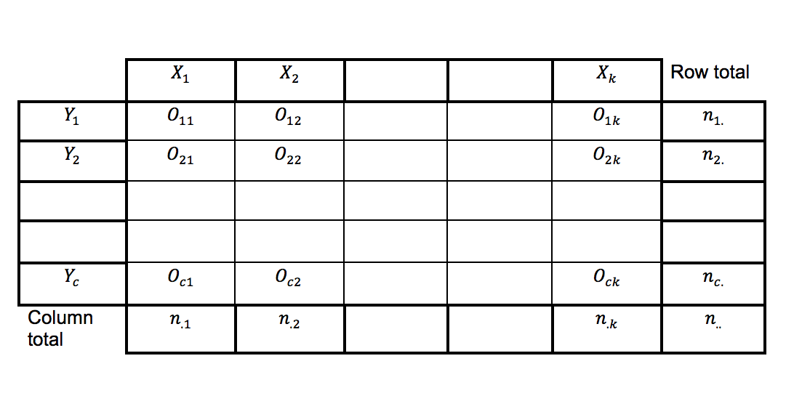
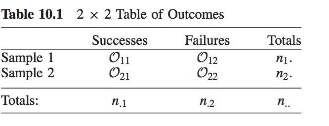
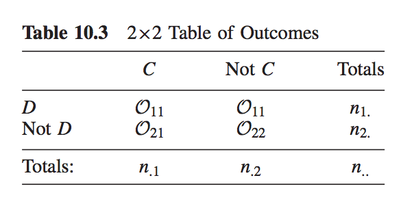

```{r setup, include=FALSE}
knitr::opts_chunk$set(echo = TRUE, fig.width = 3,fig.height = 3, fig.align="center",message=FALSE, warning=FALSE)
```

#  Recall

##
- One sample sign test, Wilcoxon signed rank test, large-sample approximation, median, Hodges-Lehman estimator, distribution-free confidence interval.
- Jackknife for bias and standard error of an estimator.
- Bootstrap samples, bootstrap replicates.
- Bootstrap standard error of an estimator.
- Bootstrap percentile confidence interval.
- Hypothesis testing with the bootstrap (one-sample problem.)
- Assessing the error in bootstrap estimates.
- Example: inference on ratio of heart attack rates in the aspirin-intake group to the placebo group.
- The exhaustive bootstrap distribution
- Discrete data problems (inferential procedures for a single success probability or random variable with multiple categories)

# More than one discrete random variable

## Contingency table

- Each discrete random variable with the same number of categories/different number of categories.
- Contingency table: Let random variable $X$ with $k$ categories and $Y$ with $c$. A contingency table is a $k \times c$ matrix of frequencies.


## Testing of two probabilities

- Data:
    
- Success probabilities of two different samples.
- Compare two unknown success probabilities, $p_{1}$, $p_{2}$, on the basis of the corresponding rates of success in independent samples.


## Testing of two probabilities

- Statistical problems
    - exact test for $p_{1} - p_{2}$.
    - approximate test for $p_{1} - p_{2}$.
    - confidence intervals for $p_{1} - p_{2}$.
- Assumptions:
    - A1. $O_{11}$ is the number of successes observed in $n_{1.}$ independent Bernoulli trials, each with success probability $p_{1}$.
    - A2. $O_{21}$ is the number of successes observed in $n_{2.}$ independent Bernoulli trials, each with success probability $p_{2}$.
    - A3. The Bernoulli trials corresponding to sample 1 are independent of the Bernoulli trials corresponding to sample 2.


## Example (Testing of two probabilities)

- $\text{H}_{0}: p_{1} = p_{2} = p$ versus $\text{H}_{A}: p_{i} \neq p$ for at least one $i$.
- Fisher's exact test (**HWC** Chapter 10.2).
- Example: 
    - Diehr et al. (1989) pointed out that it is well known that the survival of women with breast cancer tends to be lower in blacks than whites. 
    - Determine if there are statistically significant patterns of care and, if so, whether these differences can be attributed to differences between black and white patients in age, stage, type of insurance, type of hospital, or type of physician.
    - Diehr and her colleagues found that black patients were more likely than white patients to receive a liver scan.
    - $p_{1}$ probability that a black patient in the hospital receives a liver scan.
    - $p_{2}$ probability that a white patient in the hospital receives a liver scan.

## Example (Testing of two probabilities)

- Hypothesis: $\text{H}_{0}: p_{1} = p_{2}$ versus $\text{H}_{A}: p_{1} > p_{2}$.
    - one-sided alternative.
    
```{r}
df = data.frame(Yes = c(4,1), No = c(8,20))
rownames(df) = c("Black", "White"); df
```

## Example (Testing of two probabilities)

- Compute $\hat{p}_{1} = \dfrac{O_{11}}{n1.} = \dfrac{4}{12}$ and  $\hat{p}_{2} = \dfrac{O_{21}}{n2.} = \dfrac{1}{21}$.
```{r}
p1.p2.hat = round(df[,1]/rowSums(df), digits = 4)
p1.hat = as.numeric(p1.p2.hat[1]); p1.hat
```

```{r}
p2.hat = as.numeric(p1.p2.hat[2]); p2.hat
```

```{r}
n1. = sum(df[1,]); n1. 
```

```{r}
n2. = sum(df[2,]); n2.
```

## Example (Testing of two probabilities)

- Fisher's exact test

```{r}
fisher.test(df, alternative = "greater")
```

## Example (Testing of two probabilities)

There is a strong evidence that in hospital the chance that a black patient with breast cancer receives a liver scan is higher than the corresponding chance that a white patient with breast cancer receives a liver scan at 5\% significance level.

## Large-sample testing

- Hypothesis: $\text{H}_{0}: p_{1} = p_{2}$ versus $\text{H}_{A}: p_{1} > p_{2}$.
- Let $p_{d} = p_{1} - p_{2}$.
- Now hypothesis: $\text{H}_{0}: p_{d} = 0$ versus $\text{H}_{A}: p_{d} > 0$.
- Test statistic: $Z = \dfrac{\hat{p}_{1} - \hat{p}_{2}}{\text{SD}\left(\hat{p}_{1} - \hat{p}_{2}\right)}$, where $\text{SD}\left(\hat{p}_{1} - \hat{p}_{2}\right) = \sqrt{\dfrac{\hat{p}_{d}(1-\hat{p}_{d})}{n_{1.}}+ \dfrac{\hat{p}_{d}(1-\hat{p}_{d})}{n_{2.}}}$.
- $Z \sim \text{N}\left(0, 1\right)$.
- Reject $\text{H}_{0}$ if $Z \geq z_{\alpha}$.

## Example (Large-sample testing)

-  $\hat{p}_{1} = \dfrac{O_{11}}{n_{1.}} = \dfrac{4}{12}$, $\hat{p}_{2} = \dfrac{O_{21}}{n_{2.}} = \dfrac{1}{21}$, $\hat{p}_{d} = \dfrac{O_{11}+ O_{21}}{n_{1.}+ n_{2.}} = \dfrac{4+ 1}{12+ 21}$
- $\text{SD}\left(\hat{p}_{1} - \hat{p}_{2}\right) = \sqrt{\dfrac{\hat{p}_{d}(1-\hat{p}_{d})}{n_{1.}}+ \dfrac{\hat{p}_{d}(1-\hat{p}_{d})}{n_{2.}}} = \sqrt{\dfrac{0.1515(1- 0.1515)}{12}+ \dfrac{0.1515(1-0.1515)}{21}}$.

```{r}
phat.d = sum(df[,1])/sum(rowSums(df)); phat.d
```

```{r}
sd.hat = sqrt((phat.d*(1-phat.d)/12) + (phat.d*(1-phat.d)/21)); sd.hat
```

## Example (Large-sample testing)

- Observed test statistic value $Z_{0} = \dfrac{\hat{p}_{1} - \hat{p}_{2}}{\text{SD}\left(\hat{p}_{1} - \hat{p}_{2}\right)} = \dfrac{0.3333 - 0.0476}{0.1297}$
```{r}
Z.o = (p1.hat - p2.hat)/sd.hat; Z.o
```
- P-value

```{r}
pnorm(Z.o, lower.tail = F)
```
- There is a strong evidence that in hospital the chance that a black patient with breast cancer receives a liver scan is higher than the corresponding chance that a white patient with breast cancer receives a liver scan at 5\% significance level.

## Example (Large-sample confidence interval)

- Here we do not assume $p_{1} = p_{2}$ so we define a different estimator to estimate the standard deviation of $\hat{p}_{1} - \hat{p}_{2}$

- Approximate 95\% confidence interval for $p_{1} - p_{2}$ is

    $\hat{p}_{1} - \hat{p}_{2} \pm Z_{\alpha/2} \tilde{\text{SD}}\left(\hat{p}_{1} - \hat{p}_{2}\right)$, where $\tilde{\text{SD}}\left(\hat{p}_{1} - \hat{p}_{2}\right) = \sqrt{\dfrac{\hat{p}_{1}(1-\hat{p}_{1})}{n_{1.}}+ \dfrac{\hat{p}_{2}(1-\hat{p}_{2})}{n_{2.}}}$
- For the example, 

```{r}
p1.hat.minus.p2.hat = p1.hat - p2.hat 
p1.hat.minus.p2.hat
```

```{r}
Z.alpha.by.2 = qnorm(.025, lower.tail = FALSE)
Z.alpha.by.2 
```

## Example (Large-sample confidence interval)

```{r}
tilde.SD = sqrt((p1.hat*(1-p1.hat)/n1.) + 
    (p2.hat*(1-p2.hat)/n2.))
tilde.SD
```

- Approximate 95\% confidence interval for $p_{1}-p_{2}$
```{r}
round(p1.hat.minus.p2.hat + 
    c(-1,1) * Z.alpha.by.2 * tilde.SD, digits = 3)
```


## The $2 \times 2$ Chi-Squared test of homogeneity

- The large-sample testing procedure via Karl Pearson’s chi-squared statistic.

- Contingency table: Let random variable $X$ with $k$ categories and $Y$ with $c$. A contingency table is a $k \times c$ matrix of frequencies.


## The $2 \times 2$ Chi-Squared test of homogeneity

- $\text{H}_{0}: p_{1} = p_{2}$ (homogeneity hypothesis) versus $\text{H}_{A}: p_{1} \neq p_{2}$.

- Use a measure of the discrepancy between the observed frequencies $O_{ij}$, and the estimated expected frequencies $E_{ij}$ under the hypothesis.

## The $2 \times 2$ Chi-Squared test of homogeneity

- Define the expected value of $O_{11}, O_{12}, O_{21}, O_{22}$ as follows: 
    - $E_{11} = \dfrac{n_{1.} \times n_{.1}}{n_{..}}$, 
    - $E_{12} = \dfrac{n_{1.} \times n_{.2}}{n_{..}}$,
    - $E_{21} = \dfrac{n_{2.} \times n_{.1}}{n_{..}}$,
    - $E_{22} = \dfrac{n_{2.} \times n_{.2}}{n_{..}}$.
    
- Chi-squared statistic

$\chi^{2} = \sum_{i=1}^{2}\sum_{j=1}^{2} \dfrac{\left(O_{ij} - E_{ij}\right)^{2}}{E_{ij}}$.

- For the two-sided test, reject $\text{H}_{0}$ if $\chi^{2}_{\alpha,1}$, $\alpha$ upper-percentile of chi-squared distribution with 1 degrees of freedom.

## Example (The $2 \times 2$ Chi-Squared test of homogeneity)

```{r}
Table10.2 = as.matrix(df); Table10.2
prop.test(Table10.2, correct = F, alternative = "two.sided")
```

## Example (The $2 \times 2$ Chi-Squared test of homogeneity)

- $\chi^{2} = 4.85$ value is the square of $Z = 2.20$.
- We conclude using chi-squared test that there is a strong evidence that in hospital the chance that a black patient with breast cancer receives a liver scan is higher than the corresponding chance that a white patient with breast cancer receives a liver scan at 5\% significance level.

## The $2 \times 2$ Chi-Squared test of independence

- When column and row totals $n_{1.}, n_{2.}, n_{.1}, n_{.2}$ are not fixed.
- 

## The $2 \times 2$ Chi-Squared test of independence
- Each observation from a general population is cross-classified on the basis of two discrete variables (or characteristics).
- Question: whether two variables are independent (occurrence of characteristics are independent).
- Let $p_{ij}; i = 1,2, j = 1,2$ denote the true unknown joint probability of falling into cell $\left(i, j\right)$.
- Under the hypothesis of independence, all joint probabilities are equal to the product of their marginal probabilities. That is, $p_{ij} = p_{i.} \times p_{.j}$.

## The $2 \times 2$ Chi-Squared test of independence
- Test statistic 
    - $\chi^{2} = \sum_{i=1}^{2}\sum_{j=1}^{2} \dfrac{\left(O_{ij} - E_{ij}\right)^{2}}{E_{ij}}$.

- With the alternatives where association holds between the two discrete variables (characteristics), reject $\text{H}_{0}$ if $\chi^{2}_{\alpha,1}$.

## Example (The $2 \times 2$ Chi-Squared test of independence)

- Example **HWC** 10.2, page 503.
- $X$ gun registration: favor, oppose.
- $Y$ death penalty: favor, oppose.
```{r}
Table10.4 = data.frame(favor = c(784,311), 
  oppose = c(236, 66)); Table10.4
```

## Example (The $2 \times 2$ Chi-Squared test of independence)

```{r}
chisq.test(Table10.4, correct=F)
```

- P-value of .023, indicating that there is an association between the two characteristics, namely, attitude toward gun registration and attitude toward the death penalty.

## Example (The $2 \times 2$ Chi-Squared test of independence)

- The R command `chisq.test` produces the expected and observed values for the data.
```{r}
chisq.test(Table10.4, correct=F)$expected
```


## Degreee of measure of association

- Sample odds ratio $\hat{\theta}$.
- The population odds ratio $\theta = \dfrac{p_{11}p_{22}}{p_{12}p_{21}}$.
- The unconditional maximum likelihood estimator of $\theta$ is the sample odds ratio $\hat{\theta} = \dfrac{O_{11}O_{22}}{O_{12}O_{21}}$.

## Chi-squared test of independence with more than two categories

- $X$ variable with $k$ categories and $Y$ variable with $c$ categories.
- $\chi^{2} = \sum_{i=1}^{k}\sum_{j=1}^{c} \dfrac{\left(O_{ij} - E_{ij}\right)^{2}}{E_{ij}}$. Under the null hypothesis of independence $\chi^{2}$ is with $\left(k-1\right)\left(c-1\right)$ degrees of freedom.

## Association plots

- Association plots [@friendly2000, @cohen1980]
- Highlights in which cells there are more or less observations than expected.

```{r eval=FALSE}
x = margin.table(as.matrix(Table10.4), c(1,2))
assocplot(x, xlab = "death penalty", 
  ylab = "gun registration", 
  main = "Gun registration and death penalty")
```

## Association plots
```{r echo=FALSE, fig.width=4,fig.height= 5}
x = margin.table(as.matrix(Table10.4), c(1,2))
assocplot(x, xlab = "death penalty", 
  ylab = "gun registration", 
  main = "Gun registration and death penalty")
```

## Association plots

- Under the null hypothesis of independence, the residuals are expected to be zero.
- In our example, the residuals are big numbers so we reject null hypothesis of independence.
- We can use mosaic plots to visualize the observed frequencies in a contingency table.


##  References for this lecture

**HWC** Chapter 10


<!-- Homework problem: Page 513, Problem 13 (Fisher's exact test on difference on probabilities. Use `fisher.test()` function in R). -->

<!-- Homework problem: Page 509, Problem 3 (approximate confidence interval for difference of proportions) -->

<!-- Homework problem: Page 510, Problem 6 (Matched Pairs problem. Use `mcnemar.test()` function in R). -->

<!-- Homework problem: Page 510, Problem 9 ($2 \times 2$ Chi-squared test for homogeneity). -->

